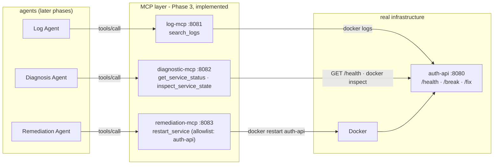
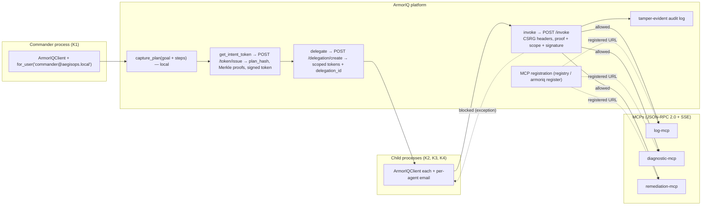
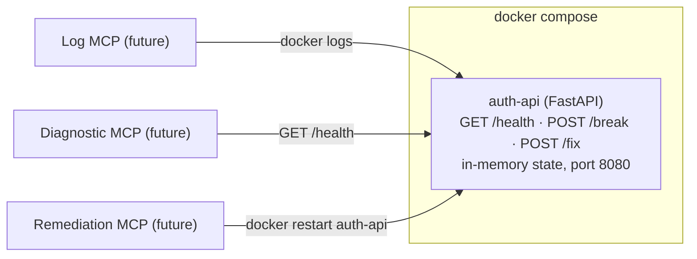
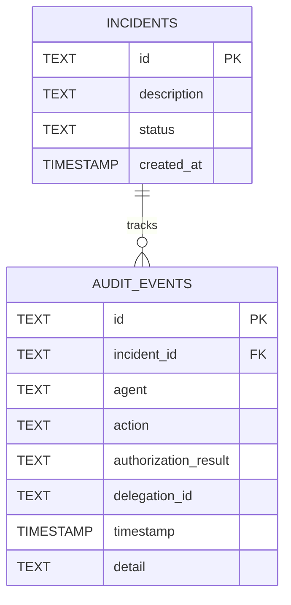

# AegisOps — ARCHITECTURE.md

**Technical blueprint.** Companion to `PLAN.md` (what we build) and `CURRENT_STATE.md` (where the project stands).
Scope: the single incident-response demo defined in PLAN.md §1. Nothing else.

---

## 1. Architecture Overview

AegisOps demonstrates that **CAPABLE ≠ AUTHORIZED**: four autonomous agent processes, each with its own
cryptographic identity, investigate and remediate a broken `auth-api` container — but only the agents whose
delegated tokens carry the authority may actually perform the restart. Authorization is enforced by the
**ArmorIQ Proxy** against signed, scoped tokens — never by string matching, and never by what the LLM "decides".

```
User / demo script
      │
      ▼
Commander Agent ──── capture_plan() → get_intent_token() → delegate() × 3
      │
      ├────► Log Agent        ──► Log MCP        ──► docker logs / log file        (read)
      ├────► Diagnosis Agent  ──► Diagnostic MCP ──► auth-api /health, docker inspect (read)
      └────► Remediation Agent──► Remediation MCP ──► docker restart auth-api        (write)

All invoke() calls pass through the ArmorIQ Proxy for verification before reaching an MCP.
```

### 1.1 The MVP (from PLAN.md §1)

| Item | Definition |
|---|---|
| **Problem** | Autonomous agents can be *capable* of an action without being *authorized* to perform it. Authorization must be proven, not assumed. |
| **User** | Operator / demo runner. Triggered via `scripts/break_service.sh` and `scripts/run_incident.sh`. |
| **Core workflow** | Break service → Commander captures plan + delegates scoped tokens → Log Agent reads logs → Diagnosis Agent inspects status/config → Diagnosis Agent *attempts* restart (BLOCKED) → Commander delegates restart → Remediation Agent restarts (ALLOWED) → health verified → audit trail shown. |
| **Agents** | Commander, Log, Diagnosis, Remediation — 4 separate processes, 4 separate Ed25519 keypairs, 4 separate ArmorIQ clients. |
| **MCP tools** | `search_logs`, `get_service_status`, `inspect_service_state` (read-only), `restart_service` (write). |
| **Real-world action** | `docker restart auth-api` — an actual container restart, observable via `/health` and container start time. |
| **Authorization boundary** | Between the ArmorIQ Proxy and the MCPs. Every `invoke()` is checked against the signed, scoped token before the tool executes. |
| **Deliberate scope violation** | Diagnosis Agent deterministically attempts `invoke("remediation-mcp", "restart_service", diag_token)` → blocked by ArmorIQ, logged as `blocked`. |
| **Successful authorized action** | Remediation Agent calls the *same* function with the *same* parameters through the *same* tool with its own delegated token → allowed → container actually restarts. |
| **ArmorIQ responsible for** | Plan capture, intent tokens, Merkle proofs, delegation minting, `invoke()` authorization verification, tamper-evident audit trail. |
| **We are responsible for** | Agent processes, inter-agent HTTP transport, MCP tools, Docker `auth-api`, SQLite mirror (`incidents`, `audit_events`), demo/reset scripts, the (optional) trail viewer. |

### 1.2 Responsibility boundaries (never blurred)

| Layer | Owns |
|---|---|
| **Our application** | Agent processes, HTTP transport, MCP tools, Docker `auth-api`, SQLite, scripts, trail viewer. |
| **ArmorIQ** | Agent identities, plan canonicalization, tokens, Merkle proofs, delegation, `invoke()` authorization decisions, platform audit log. |
| **MCP** | The 4 tool endpoints and their mapping to real infrastructure. No authorization logic lives here. |
| **Docker/infrastructure** | The real-world effect: `auth-api` container state, `/health`, `/break`, `/fix`. |
| **LLM** | Only the Diagnosis Agent's "is a restart needed? why?" rationale. Never a control-flow decision (control flow is deterministic). |

---

## 2. System Diagram


---

## 3. Component Responsibilities

| Component | Responsibility | Not responsible for |
|---|---|---|
| **Commander Agent** | Build the explicit 4-step plan; `capture_plan()` → `get_intent_token()`; `delegate()` scoped tokens to Log, Diagnosis, and (post-diagnosis) Remediation agents; write `incidents` + `audit_events` rows; coordinate via HTTP. | Never calls MCP tools directly in-process; never runs child business logic itself. |
| **Log Agent** | Receives token+task over HTTP; `invoke("log-mcp", "search_logs", ...)`; returns log lines. | Diagnosis, status checks, restart. |
| **Diagnosis Agent** | `invoke("diagnostic-mcp", "get_service_status" | "inspect_service_state", ...)`; narrow LLM call for restart rationale; **deterministically attempts** the unauthorized `restart_service` call (demo centerpiece). | Restart authority. Its token never includes `restart_service`. |
| **Remediation Agent** | Receives restart authority from Commander after diagnosis; `invoke("remediation-mcp", "restart_service", ...)`; verifies recovery. | Diagnostics, logs, decision-making. |
| **Log MCP** | Exposes `search_logs(service, keyword, since)`. | Authorization (proxy's job). |
| **Diagnostic MCP** | Exposes `get_service_status(service)`, `inspect_service_state(service)` (runtime state, redacted). | Authorization. |
| **Remediation MCP** | Exposes `restart_service(service)` → real `docker restart`. | Authorization; deciding who may call it. |
| **ArmorIQ Proxy** | Authorizes every `invoke()` against the presented token; blocks non-scoped actions; records platform audit. | Business logic, tool implementation. |
| **Docker `auth-api`** | Real service with `/health`, `/break`, `/fix`; in-memory state. | Authorization. |
| **SQLite** | Thin mirror of `incidents` + `audit_events` for the demo trail. | Authorization truth — that lives in ArmorIQ. |

---

## 4. Agent Architecture

> **Phase 6+7 status (2026-08-20):** all four agents run as genuinely separate processes. §4.1–§4.4 below
> document the ArmorIQ-enabled design (enforcement demonstrations still pending — Phases 8–9); §4.5–§4.9
> document the unguarded multi-agent system; §4.10 documents Phase 5 (per-agent identities + explicit plan
> + intent token); §4.11 documents what Phases 6–7 added (delegation + governed invocation + audit mirror).
> The two execution paths must not be confused: with a delegation present on a request, the child agent
> invokes its MCP actions **through ArmorIQ** (`invoke()` → proxy); without one (no `ARMORIQ_API_KEY`), the
> agents call the MCPs directly over localhost HTTP and the Diagnosis Agent's restart attempt succeeds —
> the unguarded baseline is preserved and reported honestly (`delegations: []`, `governed: false`). Phase 5
> added ArmorIQ *intent*; Phases 6–7 added *authority + governed invocation*; *enforcement demonstrations*
> (blocked/denied) are Phase 8+.

All four agents are **separate Python processes** (`agents/*.py`), started independently. Each owns an
Ed25519 keypair under `.keys/<role>/` and an email scope (`AEGISOPS_<ROLE>_EMAIL`, default
`<role>@aegisops.local`) for the one-key + `for_user(email)` ArmorIQ identity model — implemented Phase 5.
Inter-agent communication is HTTP: each agent exposes one `/run_task` endpoint; the Commander sends the task
over HTTP. See PLAN.md §5.

### 4.1 Commander Agent

| Aspect | Definition |
|---|---|
| **Purpose** | Owns the incident end-to-end: captures the plan, mints the root intent token, delegates scoped authority, coordinates investigation → escalation → remediation. |
| **Input** | Incident description (hardcoded by `scripts/run_incident.sh`). |
| **Output** | Root intent token; three delegations (log, diagnosis, remediation); HTTP task dispatch; `incidents` + `audit_events` rows. |
| **Identity** | Own Ed25519 keypair `K1`; own `ArmorIQClient`. |
| **Authority** | Root intent token over the full captured plan (all 4 actions) — "everything the incident *could* require" (PLAN §6). |
| **Allowed actions** | `capture_plan()`, `get_intent_token()`, `delegate()`; any plan action at root-token level. |
| **Forbidden actions** | None at plan level — but architecturally it must not execute agent business logic in-process; in the demo it never performs `restart_service` itself. |
| **MCP tools** | None directly (orchestrates exclusively via delegation). |
| **Who delegates to it** | No one — it is the root of the delegation chain (user intent is the origin). |
| **Out-of-scope attempt** | Any action not in the captured plan would be blocked by the proxy even for the root token. |

### 4.2 Log Agent

| Aspect | Definition |
|---|---|
| **Purpose** | Fetch recent log lines for the service so the diagnosis has evidence. |
| **Input** | Delegated token (`allowed_actions=["search_logs"]`) + task over HTTP from Commander. |
| **Output** | Log lines returned to Commander / carried into the diagnosis task. |
| **Identity** | Own keypair `K2`; own `ArmorIQClient`. |
| **Authority** | `search_logs` only (1 action). |
| **Forbidden actions** | `get_service_status`, `inspect_service_state`, `restart_service` — not in its allow-list. |
| **MCP tools** | `log-mcp` → `search_logs`. |
| **Who delegates to it** | Commander. |
| **Out-of-scope attempt** | Blocked by proxy; logged as `blocked` (not part of the demo's core beat, but the same mechanism). |

### 4.3 Diagnosis Agent

| Aspect | Definition |
|---|---|
| **Purpose** | Gather status + config, produce an LLM-backed rationale ("does this need a restart? yes/no + one sentence"), and — **deterministically** — attempt `restart_service` with its own token to demonstrate the block. |
| **Input** | Delegated token (`allowed_actions=["get_service_status","inspect_service_state"]`) + task (including Log Agent's excerpts) over HTTP from Commander. |
| **Output** | Diagnosis conclusion + rationale; a guaranteed `blocked` attempt; `audit_events` row(s). |
| **Identity** | Own keypair `K3`; own `ArmorIQClient`. |
| **Authority** | `get_service_status`, `inspect_service_state` — read-only diagnosis (2 actions). |
| **Forbidden actions** | **`restart_service` — the hard boundary. Also `search_logs` is not delegated to it** (log evidence arrives via the task payload). |
| **MCP tools** | `diagnostic-mcp` → `get_service_status`, `inspect_service_state`. |
| **Who delegates to it** | Commander. |
| **Out-of-scope attempt** | `invoke("remediation-mcp","restart_service", diag_token)` → **blocked by ArmorIQ Proxy** before reaching the MCP; container is NOT restarted; row logged with `authorization_result='blocked'`. This is the demo's centerpiece — never an error to hide (PLAN §10). |

### 4.4 Remediation Agent

| Aspect | Definition |
|---|---|
| **Purpose** | Perform the restart — but only after the Commander *explicitly* grants restart authority following a "restart needed" diagnosis. |
| **Input** | Delegated token (`allowed_actions=["restart_service"]`) + task over HTTP from Commander; granted *after* diagnosis concludes, so the escalation is visible. |
| **Output** | Successful `invoke()` result; post-restart health verification; `audit_events` row. |
| **Identity** | Own keypair `K4`; own `ArmorIQClient`. |
| **Authority** | `restart_service` only (1 action). |
| **Forbidden actions** | Everything else — no diagnostics, no logs. |
| **MCP tools** | `remediation-mcp` → `restart_service`. |
| **Who delegates to it** | Commander (only after diagnosis concludes a restart is needed — the "Commander decides to escalate" beat). |
| **Out-of-scope attempt** | Any non-restart action → blocked by proxy. |

### 4.5 Phase 4 implemented design — contracts

Structured JSON contracts (pydantic models in `agents/common.py`), small by design — no event bus, no broker:

| Contract | Fields | Used by |
|---|---|---|
| `Incident` | `incident_id`, `service`, `description`, `severity` (low/medium/high/critical), `timestamp` | demo script → Commander `POST /incident` |
| `InvestigationRequest` | `incident_id`, `service`, `keyword?`, `limit` (1–500) | Commander → Log Agent |
| `InvestigationResult` | `incident_id`, `service`, `evidence[{index, text}]`, `summary`, `status`, `error?` | Log Agent → Commander |
| `DiagnosisRequest` | `incident_id`, `service`, `evidence[]`, `status`, `state` | Commander → Diagnosis Agent |
| `DiagnosisResult` | `incident_id`, `service`, `diagnosis`, `confidence`, `root_cause`, `requires_remediation`, `recommended_action`, `target_service`, `remediation_attempted`, `remediation_result?`, `llm_source` (llm/fallback/none), `status`, `error?` | Diagnosis Agent → Commander |
| `RemediationRequest` | `incident_id`, `service` | Commander → Remediation Agent |
| `RemediationResult` | `incident_id`, `service`, `operation`, `success`, `noop`, `container?`, `started_at_before?`, `started_at?`, `health?`, `status`, `error?` | Remediation Agent → Commander |
| `IncidentResult` | `incident_id`, `status` (RESOLVED/FAILED), `service`, `investigation?`, `diagnosis?`, `remediation?`, `verification?`, `timeline[{ts, stage, status, detail}]`, `error?` | Commander → caller |

Peer responses are validated on receipt (pydantic) — an invalid response from any agent fails the incident
explicitly, never silently. Task-level failures return `status: "error"` + `error` in the 200 body; malformed
requests get HTTP 4xx from the framework.

### 4.6 Phase 4 implemented design — communication

All agents are HTTP servers (FastAPI/uvicorn). The Commander is the only orchestrator; peers never talk to
each other. Deterministic, one incident at a time (in-memory context):

```
User / demo script (scripts/run_incident.sh)
        │  POST /incident {incident_id, service, severity, description}
        ▼
   ┌─────────────────────────┐
   │   Commander (8094)      │   owns IncidentContext: RECEIVED → INVESTIGATING → DIAGNOSING
   │   POST /incident        │   → REMEDIATING → VERIFYING → RESOLVED | FAILED (timeline kept)
   └──────┬───────┬───────┬──┘
          │       │       │
          │ POST /run_task   │ POST /run_task            │ POST /run_task
          │ InvestigationReq │ DiagnosisReq (evidence)   │ RemediationReq
          ▼       ▼          ▼                           ▼
   Log Agent (8091)   Diagnosis Agent (8092)      Remediation Agent (8093)
        │                    │                            │
        │ log-mcp            │ diagnostic-mcp             │ diagnostic-mcp (idempotency
        │ search_logs        │ get_service_status         │ health check first)
        │                    │ inspect_service_state      │
        │                    │ LLM or marked fallback     │ remediation-mcp
        │                    │ remediation-mcp            │ restart_service
        │                    │ restart_service (UNGUARDED)│      │
        ▼                    ▼                            ▼      ▼
   ┌────────────────────────────────────────────────────────────────┐
   │                  MCP layer (log 8081 / diagnostic 8082 /       │
   │                       remediation 8083)  →  Docker  →  auth-api │
   └────────────────────────────────────────────────────────────────┘
```

Failure boundaries (§12): a dead peer, MCP error, LLM failure, or invalid response always produces a
structured `FAILED` IncidentResult with the error in `result.error` and an `incident_failed` timeline entry.
Nothing is silently swallowed; the Commander never performs the Docker restart itself.

### 4.7 Phase 4 implemented design — end-to-end incident flow

The complete unguarded workflow (proven by `tests/test_e2e.py` and `scripts/run_incident.sh`):

1. `auth-api` is healthy (`/health` → 200).
2. `POST /break` → `/health` → 503 (`unhealthy`).
3. Commander receives the incident.
4. Commander → Log Agent → `search_logs("auth-api")` → evidence + summary.
5. Commander → Diagnosis Agent with evidence → `get_service_status` + `inspect_service_state`.
6. Diagnosis Agent reasons (Gemini via `AEGISOPS_GEMINI_API_KEY`; otherwise the explicitly-marked
   deterministic test fallback) → `{requires_remediation: true, recommended_action: restart_service}`.
7. **Unguarded baseline:** the Diagnosis Agent itself calls `restart_service("auth-api")` through
   remediation-mcp → the Docker container really restarts.
8. Commander → Remediation Agent → health check first → service already healthy → idempotent no-op.
9. Commander verifies `/health` via diagnostic-mcp → 200.
10. Incident marked **RESOLVED**.

### 4.8 Phase 4 implemented design — LLM boundary

| Concern | Who handles it |
|---|---|
| HTTP, MCP calls, validation, health checks, state transitions, retries/timeouts | **Deterministic code** (agents, MCP layer) |
| Interpreting logs, combining evidence, root-cause reasoning, writing the diagnosis | **LLM** (Diagnosis Agent only, via `agents/llm.py`) |
| Strict output schema + action allowlist (`none` / `restart_service`) + service allowlist | **pydantic validation before the output is used** |
| Deciding whether to remediate / attempting the restart | **Deterministic control flow** — hardcoded: if `requires_remediation` and `recommended_action == "restart_service"` and `target_service == incident.service` |

The model never executes anything: no tool names it invents are honored (schema + allowlist reject them), and
log lines are framed as untrusted data in the system prompt (prompt-injection guard). LLM failures raise
`LLMUnavailableError` → the Diagnosis Agent returns a structured error → the incident fails loudly. The
deterministic test fallback (`AEGISOPS_LLM_FALLBACK=test`, `llm_source: "fallback"`) is the ONLY no-key path
and is never presented as model-generated.

**Provider (Phase 5):** the official `google-genai` SDK against `gemini-3.5-flash-lite` (the current stable
GA Flash-Lite model, verified against ai.google.dev on 2026-08-20; `gemini-3.1-flash-lite` is deprecated in
its favour). Structured output is requested with `response_json_schema` and re-validated locally by pydantic
(action + service allowlists still enforced client-side). Credentials: `AEGISOPS_GEMINI_API_KEY`;
`AEGISOPS_LLM_MODEL` (default `gemini-3.5-flash-lite`); `AEGISOPS_LLM_TIMEOUT` (default 30s). The Phase 4
OpenAI-compatible wrapper was removed.

### 4.9 Phase 4 implemented design — unguarded security baseline

**The Diagnosis Agent can currently reach the remediation capability, and the restart succeeds.**

This is intentional and is the exact path that becomes the **blocked demonstration** once ArmorIQ is
integrated (Phases 5–8): with delegation in place, the Diagnosis Agent's token will carry only
`get_service_status` / `inspect_service_state`, so its `restart_service` attempt will be rejected by the
ArmorIQ Proxy while the Remediation Agent's separately-delegated call succeeds. There is deliberately NO
in-code rule like `if agent == "diagnosis": deny restart` — Phase 4 is pure agent→MCP connectivity so the
later block can be attributed entirely to the cryptographic authority layer. This unsafe baseline is what
the unguarded phase exists to reproduce.

### 4.10 Phase 5 implemented design — identities + explicit plan + intent token

Phase 5 adds ArmorIQ *intent* without changing the unguarded execution path:

- **Agent identities** — `armoriq/client_setup.py` provides the per-agent lifecycle. Each role
  (`commander`, `log_agent`, `diagnosis_agent`, `remediation_agent`) has an Ed25519 keypair under
  `.keys/<role>/` (generated if missing, never regenerated, gitignored — private keys never logged or
  serialized) and an email scope `AEGISOPS_<ROLE>_EMAIL` (default `<role>@aegisops.local`). Identity is one
  API key + per-request `for_user(email)` — the SDK 0.6.10 model (`user_id`/`agent_id` deprecated).
  `scripts/ensure_identities.py` prints the four public keys and emails.
- **Explicit execution plan** — `armoriq/plan.py` builds the 4-step plan for every incident
  (`search_logs` → `get_service_status` → `inspect_service_state` → `restart_service`) and validates it
  strictly (`PlanValidationError` on malformed plans). The plan is an explicit artifact we control — the SDK
  never invents it.
- **Intent-token handshake** — the Commander runs it at the start of every `/incident`
  (`_capture_intent`): `capture_plan()` (local) then `get_intent_token()` (network). Outcome is recorded on
  `IncidentResult` as `plan`, `intent_token_status` (`ready` / `error` / `not_configured`),
  `intent_token_expires_at`, `intent_token_error`. The token object itself is NEVER stored on the context,
  never serialized into responses, and never logged (it carries `raw_token`/`jwt_token`). A missing
  `ARMORIQ_API_KEY` is reported honestly as `not_configured` and never blocks the unguarded flow.
  `scripts/armoriq_plan_token.py` runs the same handshake standalone (prints only non-sensitive metadata).
- **Deliberately NOT implemented (Phase 6+):** `delegate()`, delegated tokens, `allowed_actions`,
  `invoke()`-wrapped MCP calls, blocked diagnosis, SQLite audit, proxy flow. Phase 5 ends with the root
  intent token ready (or a clear config error).

```text
Incident received
   │
   ├─ 1. build explicit 4-step plan (local, armoriq/plan.py)   [always]
   ├─ 2. validate plan (PlanValidationError → intent_token_status=error) [always]
   ├─ 3. capture_plan() (local)                                [needs ArmorIQClient]
   ├─ 4. get_intent_token() (network) → intent_token_status    [needs ARMORIQ_API_KEY]
   │        ready | error | not_configured  (token held in memory only, never logged)
   │
   └─ then the unguarded Phase 4 flow runs exactly as before (Agent → MCP → Docker)
```

### 4.11 Phase 6+7 implemented design — delegation, governed invocation, audit mirror

Phases 6–7 add the authority layer without changing the unguarded baseline (which stays reachable and is
the regression proof):

- **Delegation (`armoriq/delegation.py`)** — the central authority matrix is enforced in code + tests:
  `log_agent → ["search_logs"]`, `diagnosis_agent → ["get_service_status", "inspect_service_state"]`,
  `remediation_agent → ["restart_service"]`. `create_delegations(client, root_token)` validates each scope
  against `_VERIFIED_SCOPES` **before any network call** (`ScopeValidationError`), binds each delegation to
  the child's own Ed25519 public key (`ensure_keypair`), and calls the verified SDK method
  `delegate(intent_token, delegate_public_key, validity_seconds, allowed_actions, target_agent)`.
  Delegated-token validity: `AEGISOPS_DELEGATION_VALIDITY` (default 300s). DelegationResult → in-memory
  `DelegationRecord` (agent, delegation_id, allowed_actions, expires_at, status, target_agent, token).
- **Commander (`_delegate_intents`)** — after a successful intent handshake the root token (memory only,
  `IncidentContext._root_token`) is used to delegate to all three children. Best-effort: a failure records
  `delegation_error` + an audit row and the incident continues unguarded — never faked, never aborting.
  `IncidentResult` carries only safe metadata: `delegations`, `delegation_error`, `governed`.
- **Child authority transport** — each dispatch carries a `DelegatedAuthority` payload (agent,
  delegation_id, allowed_actions, expires_at, target_agent, serialized token) over the local agent HTTP
  channel to the owning child only. Never logged, never serialized in responses.
- **Governed invocation (`invoke_governed` in `agents/common.py`)** — the single governed call path:
  `IntentToken.model_validate(authority.token)` → `client.invoke(mcp, action, token, params,
  user_email=<child email>)` → parse the verified `MCPInvocationResult`. Mode selection is by authority
  presence, not an env flag: request carries a delegation → governed; otherwise direct MCP (Phase 4).
- **Rejection handling** — ArmorIQ exceptions are surfaced, never swallowed: the verified `ArmorIQException`
  base is caught, `type(exc).__name__` is recorded (no hardcoded block class), an audit row is written
  (`status="blocked"` for `PolicyBlockedException`, `"error"` otherwise), and an `AgentError` surfaces into
  the incident result. The SDK's local fail-closed checks (`TokenExpiredException`, `IntentMismatchException`,
  missing proofs) behave identically.
- **Per-agent governed behavior** — Log Agent: `log-mcp.search_logs` via ArmorIQ. Diagnosis Agent:
  `diagnostic-mcp.get_service_status` + `inspect_service_state` via ArmorIQ; it holds no restart authority,
  so in governed mode it defers the restart to the Remediation Agent (the deliberate blocked attempt is the
  Phase 8 demonstration). Remediation Agent: `remediation-mcp.restart_service` via ArmorIQ; its idempotency
  health probe stays a direct read-only MCP call.
- **Audit mirror (`database/audit.py`)** — SQLite `audit_events` table (incident_id, agent, parent_agent,
  action, status, delegation_id, error_type, detail, created_at); env `AEGISOPS_AUDIT_DB` (default
  `database/audit.db`, gitignored). Safe metadata only: tokens/keys/signatures are refused
  (`_FORBIDDEN_FIELDS`, asserted by tests). Writes are best-effort and never break the incident flow.
  ArmorIQ remains the source of truth; this is a thin local mirror for the demo trail.
- **Not yet implemented (Phases 8–9):** the blocked/denied demonstrations, token-expiry demonstration,
  post-diagnosis re-delegation, proxy flow against registered MCPs.

```text
Incident received
   │
   ├─ 1–4. plan + intent token (as §4.10)                       [always]
   ├─ 5. delegate() ×3 from root token                          [needs ARMORIQ_API_KEY]
   │        success → governed=True, 3 in-memory DelegationRecords (audited)
   │        failure → governed=False, delegation_error + audit row (incident continues UNGUARDED)
   │        no key  → no root token → governed=False (honest: delegations=[], governed=false)
   │
   └─ orchestration: each child gets authority payload (or none)
        ├─ authority present → Agent → invoke() → ArmorIQ Proxy → MCP → real resource
        │      rejection → audit row (blocked/error) + AgentError surfaced in IncidentResult
        └─ no authority    → Agent → MCP → real resource (Phase 4 unguarded baseline)
```

---

## 5. Agent Authority Matrix

| Action | Commander (root token) | Log Agent (K2) | Diagnosis Agent (K3) | Remediation Agent (K4) |
|---|---|---|---|---|
| `search_logs` | ✓ (in plan) | **✓ allowed** | ✗ (not delegated) | ✗ (not delegated) |
| `get_service_status` | ✓ (in plan) | ✗ | **✓ allowed** | ✗ |
| `inspect_service_state` | ✓ (in plan) | ✗ | **✓ allowed** | ✗ |
| `restart_service` | ✓ (in plan, never executes it in demo) | ✗ | ✗ — **attempts it, blocked** | **✓ allowed (post-diagnosis delegation)** |

Key invariants:
- **Diagnosis Agent MUST NOT have restart authority.** Its delegated `allowed_actions` excludes `restart_service` by construction.
- **Remediation Agent DOES have restart authority** — but only via the token the Commander delegates after diagnosis.
- No agent can self-escalate; `delegate()` exists only on the Commander's client.

---

## 6. Delegation Model

```
User intent ("diagnose and remediate auth-api")
        │  (origin of authority — not cryptographic)
        ▼
Commander  ── capture_plan(goal + 4 steps) ──► ArmorIQ: signed plan (plan_hash, Merkle proofs)
        │  ── get_intent_token() ──► root intent token (full 4-step authority)
        │
        ├─ delegate(token, K2, allowed=["search_logs"])                 ──► Log Agent (K2)     ──► search_logs
        ├─ delegate(token, K3, allowed=["get_service_status","inspect_service_state"]) ──► Diagnosis Agent (K3) ──► status/config
        └─ delegate(token, K4, allowed=["restart_service"])  [AFTER diagnosis]  ──► Remediation Agent (K4) ──► restart_service
```

### 6.1 Authority levels

| Level | Holder | What it authorizes |
|---|---|---|
| **Original user intent** | Demo script / user | The incident to handle (not cryptographic). |
| **Commander authority** | Commander + root token | The full captured 4-step plan, at root-token level. |
| **Delegated authority** | Child agents via `delegate()` | Subset of plan steps in `allowed_actions`, bound to the child's public key, time-limited. |
| **Tool-level authority** | ArmorIQ Proxy at `invoke()` | Whether this exact token may perform this exact action → forward to MCP or block. |
| **Resource-level boundaries** | MCPs + Docker | Only the 4 tool endpoints exist; no generic shell/exec tool anywhere (PLAN §9). |

### 6.2 Where the security boundary lives

The security boundary is **between the ArmorIQ Proxy and the MCPs**. The LLM (or a prompt-injected log line)
may *decide* to attempt anything; the token presented at `invoke()` determines whether the MCP ever runs.
The Diagnosis Agent's attempt and the Remediation Agent's call are byte-identical
(`restart_service("auth-api")`, same MCP, same params) — only the signed token differs (PLAN §2).

---

## 7. MCP Architecture

**Implemented in Phase 3 (2026-08-19)**. Three MCP servers, each exposing narrowly scoped tools. The MCP layer
defines **what capabilities exist**; ArmorIQ (later phases) decides **which agent is authorized** to use them;
no authorization logic lives in the MCPs.

### 7.1 Transport (verified)

| Item | Decision | Verified how |
|---|---|---|
| Protocol library | **Official MCP Python SDK** (`mcp==2.0.0`, PyPI, MIT) — the current stable release line; serves every protocol revision from one server | Installed + introspected; `MCPServer` + `mcp.run(transport="streamable-http")` |
| Transport | **Streamable HTTP** (`POST /mcp`, SSE responses). This is the modern official transport and its wire format matches the ArmorIQ MCP Format Requirements byte-for-byte: JSON-RPC 2.0 over HTTP, `Content-Type: text/event-stream`, `event: message` + `data: {jsonrpc}`, methods `initialize` / `tools/list` / `tools/call`, tool results `content: [{type: "text", text: "<JSON string>"}]` | Raw HTTP probe test (`tests/test_mcp_spike.py::test_wire_format_is_armoriq_compatible_sse`) |
| Session handling | 2025-era clients must echo the `Mcp-Session-Id` header returned by `initialize` on subsequent calls (standard streamable HTTP behavior; the SDK `Client` does this automatically, the dev scripts do it explicitly) | `scripts/discover_tools.sh` / `call_mcp_tool.sh` |
| Protocol methods | `initialize`, `tools/list`, `tools/call` (2025-era handshake, which ArmorIQ requires); the same server also answers 2026-era clients | Client probe + raw wire tests |
| Server identity | Names registered under `log-mcp`, `diagnostic-mcp`, `remediation-mcp` (exact names ArmorIQ registration must match) | `MCPServer(name=...)` |

The Phase 2 note "the plain HTTP fallback is NOT viable" is resolved: the official SDK's streamable HTTP
transport IS the required format — no custom protocol code needed.

### 7.2 Connectivity decision

Verified against current official ArmorIQ docs (`docs.armoriq.ai`, checked 2026-08-19):

- **ArmorIQ MCP Format Requirements** require a **public HTTPS URL** for registered MCPs, with authentication
  and "production-ready" error handling. The hosted proxy resolves the target URL from the registration
  (dashboard / `armoriq register`) or per-MCP overrides (`proxy_endpoints` in the SDK config / `mcp_servers`
  in `armoriq.yaml`).
- **Localhost is NOT reachable from the hosted proxy.** `localhost` only works with a client running on the
  same host (local development, the SDK `Client`, or a self-hosted ArmorIQ stack).
- **Self-hosting ArmorIQ is officially supported** (`docs.armoriq.ai/platform/self-hosting`; the SDK supports
  `use_production=False` + local endpoints, and `ARMORIQ_ENV=local` flips all endpoints to localhost). A
  self-hosted proxy on the same machine CAN reach MCPs on localhost.
- **Tunnels are a documented deployment concern, not app code.** Exposing a local MCP to the hosted proxy
  requires a public HTTPS tunnel (e.g. ngrok/cloudflared) — provider choice is a deployment decision, never
  hardcoded into the application.

**Selected architecture for AegisOps:**

| Mode | Setup | Used for |
|---|---|---|
| **Local development** | MCPs on `127.0.0.1:8081-8083`; talk to them with the SDK `Client`, `scripts/call_mcp_tool.sh`, or the tests. No ArmorIQ needed. | Day-to-day dev + Phase 3 verification + Phase 4 unguarded agents |
| **ArmorIQ-connected (hosted proxy)** | Each MCP gets a public HTTPS URL via a tunnel (or a reachable deploy); register under the exact names; the proxy invokes them over the verified wire format. | The full authorized flow (Phases 5-9) |
| **ArmorIQ-connected (self-hosted proxy)** | Run the ArmorIQ stack locally (`use_production=False`, proxy on localhost) — officially supported; proxy reaches the MCPs directly on localhost. | Fallback if hosted registration/tunnel is unavailable |

### 7.3 Server boundaries

| MCP server | Module | Port | Capability | Nature |
|---|---|---|---|---|
| `log-mcp` | `mcp_servers/log_mcp.py` | 8081 | `search_logs` | Read-only |
| `diagnostic-mcp` | `mcp_servers/diagnostic_mcp.py` | 8082 | `get_service_status`, `inspect_service_state` | Read-only |
| `remediation-mcp` | `mcp_servers/remediation_mcp.py` | 8083 | `restart_service` | **Write** (the only write tool in the system) |

Package name note: the local package is `mcp_servers/` (not `mcp/`) because the official SDK ships a package
named `mcp` — the local directory must not shadow it.

### 7.4 Tool schemas

All schemas are explicit (generated from the tool signatures, visible via `tools/list`); a service name is
always resolved through the `SERVICES` allowlist map (`mcp_servers/common.py`, currently only
`auth-api` → container `auth-api`) — never interpolated into a shell string.

#### `log-mcp.search_logs(service, keyword=None, since=None, limit=50)`

| Aspect | Definition |
|---|---|
| Description | Return recent log lines for a service (read-only; `docker logs` backed — the log source is auth-api's stdout per PLAN §3) |
| Parameters | `service: str` **required**; `keyword: str?` (substring filter); `since: str?` (docker `--since`, e.g. `10m` or RFC3339); `limit: int = 50` (1-500) |
| Validation | service on allowlist → else ToolError; limit must be int in 1..500 |
| Return | `{"service", "count", "lines": [...]}` (JSON string in the `text` content item) |
| Errors | unknown service; docker CLI unavailable; docker logs failure (stderr included) |
| Side effects | None |
| Security sensitivity | Read-only; no filesystem access, no SQL, no shell |

#### `diagnostic-mcp.get_service_status(service)`

| Aspect | Definition |
|---|---|
| Description | Live `/health` state of a service; unhealthy is returned as data, never as failure |
| Parameters | `service: str` **required** |
| Validation | allowlist |
| Return | `{"service", "http_code", "status", "uptime_seconds"}` |
| Errors | unknown service; auth-api unreachable |
| Side effects | None |
| Security sensitivity | Read-only; the Diagnosis Agent's main tool |

#### `diagnostic-mcp.inspect_service_state(service)`

| Aspect | Definition |
|---|---|
| Description | Container runtime state from `docker inspect` — secret-bearing fields (env, config, args) are NOT included |
| Parameters | `service: str` **required** |
| Validation | allowlist |
| Return | `{"service", "running", "started_at", "restart_count", "health_status", "image"}` |
| Errors | unknown service; container missing; parse failure |
| Side effects | None |
| Security sensitivity | Read-only, redacted output |

#### `remediation-mcp.restart_service(service_name)`

| Aspect | Definition |
|---|---|
| Description | Restart a service **for real** (`docker restart <container>`) and wait until `/health` recovers (30s window) |
| Parameters | `service_name: str` **required** |
| Validation | **explicit allowlist** (`auth-api` only); anything else rejected — including `"auth-api; rm -rf /"`, `"postgres"`, `""` |
| Return | `{"service", "operation": "restart_service", "success", "container", "started_at_before", "started_at", "health"}` |
| Errors | unknown service; docker CLI unavailable; docker restart failure (stderr); recovery timeout |
| Side effects | **Real Docker restart** — container start time changes, in-memory state reset |
| Security sensitivity | The only write capability in the system; single-purpose by construction — no `run_shell` / `docker_exec` / `run_command` / `bash` tool exists anywhere in the MCP layer |

### 7.5 Security model (Phase 3)

- **MCP = capability**: each server exposes only its narrow tools; there is no generic shell/command escape hatch.
- **ArmorIQ = authorization** (future phases): decides whether THIS agent may invoke a capability, via
  delegated tokens. The MCPs perform no agent checks — that would be a fake boundary.
- **Explicit allowlist**: service names are resolved through `SERVICES` only; `subprocess` calls use fixed
  argument lists, never `shell=True`, never string interpolation.
- **Read/write split**: only `remediation-mcp` writes; the Diagnosis Agent's tool surface is read-only by
  construction, which is what makes the Phase 8 blocked-restart demonstration meaningful.

### 7.6 Intended agent → capability mapping (documented, NOT enforced in code)

| Agent (Phase 4+) | Allowed MCPs | Tools | Forbidden |
|---|---|---|---|
| Log Agent | `log-mcp` | `search_logs` | diagnostic + remediation MCPs |
| Diagnosis Agent | `diagnostic-mcp` (+ log results via task payload) | `get_service_status`, `inspect_service_state` | **`remediation-mcp`** — will attempt `restart_service` and be blocked by ArmorIQ |
| Remediation Agent | `remediation-mcp` | `restart_service` | diagnostic + log MCPs |

Enforcement happens at the ArmorIQ layer via delegated `allowed_actions`, never inside the MCP code.

### 7.7 Diagram



---

## 8. ArmorIQ Architecture

ArmorIQ is the **source of truth for cryptographic authorization**. We do not implement any of this — we call
the SDK. Facts below were verified on 2026-08-19 against `docs.armoriq.ai` (current docs) **and** the installed
`armoriq-sdk 0.6.10` (signatures introspected from the installed package). Anything not yet confirmed is marked
`UNVERIFIED`.

### 8.1 Verified — SDK package & environment

| Item | Verified fact |
|---|---|
| Package | `armoriq-sdk` on PyPI; ships the `armoriq_sdk` library **and** the `armoriq` CLI in one install |
| Version installed | `0.6.10` (Beta). |
| Python support | `>=3.10, <3.14`. **Python 3.14 is NOT supported** — project venv uses Python 3.12.10 |
| CLI commands | `login`, `logout`, `whoami`, `init`, `validate`, `register`, `status`, `logs`, `orgs`, `switch-org`, `keys`, `policy`. `login` is browser OAuth device-code → writes `~/.armoriq/credentials.json` |
| Client init | `ArmorIQClient(api_key=...)`; also `ArmorIQClient()` reading `ARMORIQ_API_KEY` env or credentials file; also `ArmorIQClient.from_config("armoriq.yaml")`. Constructor (verified): `(iap_endpoint, proxy_endpoint, backend_endpoint, proxy_endpoints, user_id, agent_id, context_id, timeout=30.0, max_retries=3, verify_ssl=True, api_key, use_production=True, mcp_credentials, iap_public_key)` |
| Identity model | **One-key, per-request-email model.** `user_id`/`agent_id` are deprecated in the current SDK (resolved per-request from API key + email). Per-user scoping via `client.for_user(email)`. API key must start `ak_live_` / `ak_test_` / `ak_claw_`; missing/malformed key → `ConfigurationException` |

### 8.2 Verified — API signatures (introspected from installed 0.6.10)

| Method | Verified signature | Notes |
|---|---|---|
| `capture_plan` | `capture_plan(llm: str, prompt: str, plan: dict | None = None, metadata: dict | None = None) -> PlanCapture` | **Local, no network.** Plan dict must contain `steps`; empty/malformed plans rejected. In 0.6.10 `PlanCapture` exposes only `plan/llm/prompt/metadata` — `plan_hash`/`merkle_root`/`ordered_paths` shown in docs are NOT on the object (hashing happens server-side) |
| `get_intent_token` | `get_intent_token(plan_capture: PlanCapture, policy: dict | None = None, validity_seconds: float = 60.0) -> IntentToken` | **Network.** Docs default validity is 60 s (short by design) — pass explicit validity. Raises `InvalidTokenException` (issuance failure), `PolicyBlockedException`. `IntentToken` fields (verified): `token_id, plan_hash, plan_id, signature, issued_at, expires_at, policy, composite_identity, client_info, policy_validation, step_proofs, total_steps, raw_token, jwt_token, policy_snapshot, subtree_delegation` |
| `invoke` | `invoke(mcp: str, action: str, intent_token: IntentToken, params: dict | None = None, merkle_proof: list | None = None, user_email: str | None = None) -> MCPInvocationResult` | **Network.** `merkle_proof` auto-generated when omitted. Raises `IntentMismatchException` (action not part of the plan / step-verification failure), `TokenExpiredException`, `MCPInvocationException`. `MCPInvocationResult` fields (verified, differ from docs' dict shape): `mcp, action, result, status, execution_time, verified, metadata` |
| `delegate` | `delegate(intent_token: IntentToken, delegate_public_key: str, validity_seconds: int = 3600, allowed_actions: list | None = None, target_agent: str | None = None, subtask: dict | None = None) -> DelegationResult` | **Network.** `delegate_public_key` = Ed25519 public key, **raw-bytes hex** (64 hex chars). Raises `DelegationException`. `DelegationResult` fields (verified): `delegation_id, delegated_token, delegate_public_key, target_agent, expires_at, trust_delta, status, metadata`. Security properties (docs): cryptographically bound, non-transferable, time-limited, action-restricted, auditable, revocable |
| `invoke_with_policy` | `invoke_with_policy(mcp, action, intent_token, params=None, options: InvokeOptions | None = None)` | For hold/approval flows — not needed for the MVP; noted for completeness |

### 8.3 Verified — Proxy & MCP connectivity

| Item | Verified fact |
|---|---|
| What the Proxy is | A **hosted, stateless reverse proxy** (part of the ArmorIQ platform; self-hosting exists as an option). Intercepts all traffic between SDKs and MCP servers; has no database |
| What it does per `invoke()` | Authenticates the request (API key / JWT / CSRG proof headers: `X-API-Key`, `X-CSRG-Path`, `X-CSRG-Value-Digest`, `X-CSRG-Proof`) → resolves target URL from token claims or dynamic MCP lookup → enforces policies → verifies the step via backend IAP + CSRG Merkle proof → forwards to the MCP → supports SSE streaming → creates audit log |
| Token issuance | `get_intent_token` → `POST /token/issue` via proxy → CSRG-IAP builds Merkle tree, computes SHA-256 hash of canonical plan, signs Ed25519 → token with `plan_hash` + `merkle_root` returned |
| MCP pre-registration | **REQUIRED.** MCPs must be registered on the platform (MCP Registry: dashboard "Add MCP", or the `armoriq register` CLI). The MCP name in SDK calls must match the registered name exactly |
| MCP wire format | **JSON-RPC 2.0 over HTTP, SSE responses.** `POST /mcp`; methods `initialize`, `tools/list`, `tools/call`; response `event: message\ndata: {jsonrpc}\n\n`; `tools/call` result content items `{type: "text", text: <JSON string>}`. The "plain HTTP service" fallback in the original architecture is **NOT viable** — the proxy speaks this protocol to reach tools |
| MCP deployment | Docs require a public HTTPS URL for registered MCPs. **RESOLVED (Phase 3):** localhost is NOT reachable from the hosted proxy; local development talks to MCPs directly on localhost; the ArmorIQ-connected modes are (a) public HTTPS tunnel to the local MCP or (b) a self-hosted ArmorIQ stack (`use_production=False` / `ARMORIQ_ENV=local`, proxy on localhost) which can reach local MCPs directly. Tunnel provider choice stays a deployment concern, not app code. See §7.2 |

### 8.4 Verified — errors & blocked actions

| Case | Verified behavior |
|---|---|
| Action not in captured plan | `IntentMismatchException` (step-verification failure at proxy) |
| Tool not in policy allow-list | `PolicyBlockedException` |
| Token expired | `TokenExpiredException` |
| Token/plan mismatch | `InvalidTokenException` |
| Delegation denied | `DelegationException` |
| MCP server error | `MCPInvocationException` |
| Delegated token lacking an allowed action (the Diagnosis Agent beat) | `UNVERIFIED` — either `IntentMismatchException` or `PolicyBlockedException`; confirm at runtime in Phase 8 and handle both. Blocked path is exception-based, not a `success: false` result |
| All exceptions inherit | `ArmorIQException` |

### 8.5 Unverified / open items

- Whether the hosted proxy can reach MCPs running locally in Docker for the demo (§8.3).
- Which exception a scope-violating delegated token raises (§8.4).
- Whether `agent_id` still has any effect in 0.6.10 despite deprecation (constructor accepts it).
- Real-key network path: `get_intent_token()` / `invoke()` / `delegate()` end-to-end with a live `ARMORIQ_API_KEY` (smoke test full mode needs one).

### 8.6 Delegation & authorization design (unchanged)

> **Phase 6+7 status (2026-08-20):** the design below is the target. Phase 5 implemented the foundation up to
> and including the root **intent token** (`capture_plan` → `get_intent_token`, see §4.10). Phases 6–7 wired
> in `delegate()` (scoped, key-bound, in-memory) and `invoke()` (governed path, rejections surfaced +
> mirrored to the SQLite audit table) — see §4.11. The proxy/registered-MCP enforcement flow and the
> blocked/denied demonstrations remain Phase 8+ (the runtime exception mapping is unverified without a live
> key).

The intended flow (unchanged from the original design):

| Concept | Role in AegisOps |
|---|---|
| **Agent identities** | Each of the 4 processes runs its own `ArmorIQClient` (own API key usage) and its own Ed25519 keypair. With the one-key/for_user model, per-agent identity is carried by: separate processes + separate keypairs (bound at `delegate()`) + a per-agent email (`commander@aegisops.local`, etc.) passed as `user_email` for audit/policy scoping |
| **Keypairs** | Each process generates its own Ed25519 keypair at startup (`cryptography`, mechanism verified: `armoriq/client_setup.py`). Public keys (raw-bytes hex) are handed to the Commander for `delegate()`; private keys never leave their process |
| **`capture_plan()`** | Does **not** call an LLM. The Commander supplies the explicit `goal` + `steps` structure naming our registered MCPs/actions. Verified local, no network |
| **`get_intent_token()`** | Proxy/IAP canonicalizes the plan → `plan_hash` → Merkle tree → signed token + per-step proofs (returned on the `IntentToken`) |
| **`delegate()`** | Mints a new, restricted, non-transferable, time-limited token bound to the delegate's public key, with explicit `allowed_actions`; returns `delegation_id` + `trust_delta`. Children never self-escalate — only the Commander calls `delegate()` |
| **`invoke()`** | Verified at the proxy: Merkle proof, CSRG path, value digest, token signature, scope. Allowed → forwarded to the MCP. Not in scope → exception (see §8.4) |
| **Authorization enforcement** | Keyed on the signed token/allow-list, never on action-name strings. Renaming `restart_service` → `svc_bounce_x92` in both places changes nothing (PLAN §2) |
| **Blocked actions** | Anything outside the presented token's `allowed_actions` / plan proof — e.g. Diagnosis Agent → `restart_service` |
| **Allowed actions** | Exactly what the presented token's allow-list contains — e.g. Remediation Agent → `restart_service` |
| **Audit trail** | ArmorIQ keeps the platform-side audit log. We mirror every `delegate()`/`invoke()` result into our local `audit_events` table for the demo trail (PLAN §7) |

### 8.7 Lifecycle diagram



---

## 9. Infrastructure Architecture

Minimal Docker environment (PLAN §3, §13 Phase 2). **Implemented in Phase 2 (2026-08-19); all behaviors below
are verified by tests and manual runs.**

### 9.1 Services

| Service | Why it exists | State |
|---|---|---|
| `auth-api` (FastAPI, `infrastructure/auth_api/main.py`) | The service we break and heal — the real-world effect of `restart_service` | In-memory `broken` flag + `started_at`. `/health` → 200 `{"status":"healthy",...}` when healthy, 503 `{"status":"unhealthy","reason":"simulated_failure",...}` when broken. A real container restart resets the flag → healthy again. |
| Postgres (optional) | Cosmetic only — **cut** | Not in the compose file; add only if "real infra" flavor is ever needed. |

### 9.2 Health model & lifecycle (implemented)

| Phase | Mechanism | Verified |
|---|---|---|
| **Start** | `scripts/start_env.sh` → `docker compose up -d --build`, polls `/health` until 200 (30s cap) | ✅ |
| **Check** | `scripts/check_health.sh` → `curl /health` | ✅ |
| **Break** | `scripts/break_service.sh` → `POST /break` flips the in-memory flag → `/health` returns 503 **without stopping the container** (so a future `get_service_status()` can still observe it) | ✅ |
| **Detect** | (future) `get_service_status()` hits `auth-api` `/health` — endpoint ready | — |
| **Restart** | `scripts/restart_service.sh` → `docker restart auth-api` — the real operation the future Remediation MCP's `restart_service()` will wrap. Start time changes; broken flag cleared by process restart | ✅ |
| **Verify** | Poll `/health` until 200 OK, 30s timeout | ✅ |
| **App-level fix** | `scripts/fix_service.sh` → `POST /fix` clears the flag without a restart (recovery path distinct from the real restart; used by tests and reset) | ✅ |
| **Reset** | `scripts/reset_demo.sh` → `docker compose down -v && up -d --build` + wait healthy (Phase 7 will also clear the SQLite tables here) | ✅ |

### 9.3 Container details

- `Dockerfile`: `python:3.12-slim`, installs `fastapi==0.141.1` + `uvicorn==0.52.4`, exposes 8080, includes a
  `HEALTHCHECK` hitting `/health`.
- Compose: single root `docker-compose.yml`, service `auth-api`, `container_name: auth-api`, host port `8080:8080`,
  `restart: unless-stopped`. (One compose file only — the infra-local duplicate is not created.)

### 9.4 Infrastructure diagram



### 9.5 Security boundary (for the future remediation tool)

The future Remediation MCP must expose a **narrowly scoped operation**, not arbitrary shell. The intended shape:
`restart_service(service: str)` → validated `service` argument → `docker restart auth-api` (fixed mapping, no
shell interpolation, no generic `run_shell(command)` anywhere). Authorization is enforced upstream at the
ArmorIQ Proxy; the tool itself stays single-purpose.

---

## 10. Data Architecture

Only the minimum persistent data (PLAN §7). SQLite, raw `sqlite3`, no ORM.

### 10.1 Entities

**`incidents`**

| Field | Type | Notes |
|---|---|---|
| `id` | TEXT (PK) | Incident identifier |
| `description` | TEXT | Incident description (e.g. "auth-api unhealthy") |
| `status` | TEXT | `open` / `investigating` / `resolved` |
| `created_at` | TIMESTAMP | |

**`audit_events`**

| Field | Type | Notes |
|---|---|---|
| `id` | TEXT (PK) | |
| `incident_id` | TEXT (FK → incidents) | Ties blocked + allowed rows to the same incident |
| `agent` | TEXT | `commander` / `log` / `diagnosis` / `remediation` |
| `action` | TEXT | e.g. `restart_service` |
| `authorization_result` | TEXT | `allowed` / `blocked` / `error` |
| `delegation_id` | TEXT, nullable | From ArmorIQ `delegate()` result |
| `timestamp` | TIMESTAMP | |
| `detail` | TEXT | Free text: params, error messages, rationale |

### 10.2 Storage split

| Stored where | What |
|---|---|
| **Locally (SQLite)** | `incidents`; `audit_events` — a **thin mirror** of ArmorIQ results so the demo trail renders without querying the platform live. |
| **ArmorIQ platform** | Signed tokens, plan hashes, Merkle proofs, delegation records (`delegation_id`, `trust_delta`), tamper-evident audit log — the authoritative crypto records. |
| **Not stored** | Log payloads, config contents, LLM prompts; optional: diagnosis rationale in `audit_events.detail`. |



---

## 11. Security Model

No implementation — the design (PLAN §9, §2):

- **Least privilege** — each delegated token's `allowed_actions` contains only what the role needs: Log = 1, Diagnosis = 2, Remediation = 1.
- **Agent isolation** — 4 separate processes; no shared in-process state; the Commander never calls child business logic in-process.
- **Separate identities** — each process has its own Ed25519 keypair; delegated tokens are cryptographically bound to the delegate's public key, so a token from one process can't be presented by another (PLAN §9).
- **Delegation** — only the Commander calls `delegate()`; children cannot self-escalate; tokens are non-transferable and time-limited.
- **Scope enforcement** — the ArmorIQ Proxy checks the token's allow-list + Merkle proof at every `invoke()`. Enforcement is keyed on the signed artifact, not on action-name strings.
- **Prompt injection from logs** — a malicious log line seeds the log source (PLAN §9): even if it manipulates the Diagnosis Agent's LLM into "deciding" to restart, the deterministic follow-up attempt is blocked — capability ≠ authority.
- **Unauthorized tool calls** — demonstrated by the Diagnosis Agent's `restart_service` attempt and blocked by design; logged as `blocked` (a success case for the demo, never an error to hide).
- **Auditability** — every `delegate()`/`invoke()` produces records mirrored into `audit_events`; walk the trail live in the demo.
- **Secrets** — `ARMORIQ_API_KEY` only in `.env` (gitignored); never logged or printed.

**Central rule:** the LLM may decide to attempt something; **ArmorIQ decides whether the agent is AUTHORIZED** to perform it. The Diagnosis Agent restart attempt is the canonical example.

---

## 12. Failure Boundaries

From PLAN §10. **Phase 4 implemented behavior**:

| Failure | Phase 4 behavior (implemented) |
|---|---|
| **LLM fails** (unreachable endpoint, bad key, invalid JSON, schema violation) | `LLMUnavailableError` → Diagnosis Agent returns structured `error` → incident FAILED. Never faked. With no key configured: clear error, unless `AEGISOPS_LLM_FALLBACK=test` selects the explicitly-marked deterministic fallback. |
| **MCP unavailable / tool error** | `MCPToolError` → the agent returns `status: "error"` in its result → Commander marks FAILED with the reason. |
| **Peer agent unreachable / invalid response** | `post_json`/pydantic validation raises `AgentError` → Commander marks FAILED. (Proven by test.) |
| **Service does not recover after restart** | remediation-mcp `restart_service` raises → remediation agent returns error → FAILED. |
| **Invalid tool arguments** | MCP rejects (allowlist/limit checks); agent surfaces the error. |
| **Duplicate execution** | Idempotency implemented: Remediation Agent health-checks first; healthy service → `noop: true`, no second restart. |
| **Agent process crash** | Independent processes — only that agent stops; peers' calls fail fast with a clear error. |

---

## 13. Repository Structure

Per PLAN.md §12, plus the three project documents at root:

```
AegisOps/
├── agents/
│   ├── __init__.py            # package exports (re-exports contracts/helpers)
│   ├── common.py              # contracts (pydantic), JSON structured logging, MCP + HTTP transport helpers
│   ├── llm.py                 # Gemini (google-genai) LLM integration + strict output validation + marked test fallback (Phase 4/5)
│   ├── commander.py           # Process 1 (port 8094): orchestration, incident context, RESOLVED/FAILED (Phase 4 - implemented)
│   ├── log_agent.py           # Process 2 (port 8091): search_logs via log-mcp (Phase 4 - implemented)
│   ├── diagnosis_agent.py     # Process 3 (port 8092): status/state + LLM diagnosis + UNGUARDED restart attempt (Phase 4 - implemented)
│   └── remediation_agent.py   # Process 4 (port 8093): idempotent restart via remediation-mcp (Phase 4 - implemented)
├── mcp_servers/              # MCP layer (Phase 3 - implemented). NOT named "mcp" (shadows the official SDK package)
│   ├── common.py             # shared: MCPServer factory, SERVICES allowlist, docker/health helpers, ToolError
│   ├── spike.py              # minimal transport spike: health_check tool, port 8090 (re-verification artifact)
│   ├── log_mcp.py            # log-mcp :8081 - search_logs (read-only)
│   ├── diagnostic_mcp.py     # diagnostic-mcp :8082 - get_service_status, inspect_service_state (read-only)
│   └── remediation_mcp.py    # remediation-mcp :8083 - restart_service (write, allowlist-scoped)
├── armoriq/
│   ├── __init__.py            # package exports
│   ├── client_setup.py        # env loading, ARMORIQ_API_KEY validation, client factory, per-agent Ed25519 keypair lifecycle + email scopes (Phase 5)
│   ├── plan.py                # explicit 4-step plan: build/validate -> capture_plan -> get_intent_token (Phase 5)
│   └── delegation.py          # Phase 6: verified scopes, create_delegations (delegate ×3), in-memory DelegationRecord, safe metadata
├── infrastructure/
│   ├── auth_api/
│   │   ├── main.py           # FastAPI app: /health, /break, /fix (in-memory state)
│   │   ├── requirements.txt  # fastapi + uvicorn (container deps, pinned)
│   │   ├── Dockerfile        # python:3.12-slim, port 8080, HEALTHCHECK
│   │   └── .dockerignore
├── database/
│   ├── __init__.py            # Phase 7: exports AuditStore, get_store, audit
│   ├── audit.py               # Phase 7: SQLite audit mirror (safe metadata only; AEGISOPS_AUDIT_DB)
│   └── audit.db               # (gitignored) local audit mirror
├── tests/
│   ├── conftest.py            # shared fixtures/helpers: env, MCP+agent spawning, hermetic LLM fallback, suite-port reclaim
│   ├── test_infrastructure.py # Phase 2: health/break/real-restart lifecycle (5 tests)
│   ├── test_mcp_spike.py      # Phase 3: transport wire format + spike round-trip (4 tests)
│   ├── test_mcp_tools.py      # Phase 3: all three MCPs, incl. real restart integration (13 tests)
│   ├── test_agents_unit.py    # Phase 4: contracts, LLM validation, fallback, lifecycle, no-shell (31 tests)
│   ├── test_agents_integration.py # Phase 4: real processes + real MCPs + real Docker (7 tests)
│   ├── test_phase5.py         # Phase 5: identities, plan validation, intent-token states, token never serialized (14 tests)
│   ├── test_phase67.py        # Phase 6+7: delegation scopes/keys/metadata, governed invoke, audit mirror, no secrets (17 tests)
│   ├── test_e2e.py            # Phase 4/5: full incident -> real restart -> RESOLVED + plan/intent/delegation assertions (1 test)
│   ├── test_authorization.py  # Phase 8: Security path (blocked) + happy path (allowed) — critical
│   └── test_e2e_authorized.py # Phase 9/10: full flow with ArmorIQ enforcement
├── scripts/
│   ├── armoriq_smoke_test.py  # SDK smoke test (Phase 1): local checks + optional network checks
│   ├── ensure_identities.py   # Phase 5: per-agent keypairs + email scopes (public keys only)
│   ├── armoriq_plan_token.py  # Phase 5: standalone capture_plan -> get_intent_token (needs real key)
│   ├── spike_probe.py         # Phase 3: client probe for the transport spike (spike must be running)
│   ├── start_env.sh           # compose up + wait for health
│   ├── check_health.sh        # curl /health
│   ├── break_service.sh       # POST /break
│   ├── fix_service.sh         # POST /fix (app-level recovery)
│   ├── restart_service.sh     # docker restart auth-api (the real remediation operation)
│   ├── start_mcps.sh          # Phase 3: start the three MCP servers (background, PID files in logs/)
│   ├── check_mcps.sh          # Phase 3: initialize handshake per MCP
│   ├── discover_tools.sh      # Phase 3: tools/list for one MCP
│   ├── call_mcp_tool.sh       # Phase 3: invoke one tool with JSON args
│   ├── stop_mcps.sh           # Phase 3: stop the MCP servers
│   ├── start_agents.sh        # Phase 4: start the four agents (background, PID files in logs/agents/)
│   ├── stop_agents.sh         # Phase 4: stop them
│   ├── run_incident.sh        # Phase 4: one complete incident end to end (implemented)
│   └── reset_demo.sh          # compose down -v + up; (future) + clear SQLite rows
├── .env.example               # ARMORIQ_API_KEY placeholder + optional endpoint overrides — never the real .env
├── .gitignore                 # .env, .venv, .keys/, .armoriq/, *.db, logs/, __pycache__, .pytest_cache
├── .keys/                     # (gitignored) per-agent Ed25519 keypairs: <agent>.pem + <agent>.pub (Phase 5+)
├── docker-compose.yml         # auth-api
├── requirements.txt           # + fastapi, uvicorn for the agent processes (Phase 4)
├── README.md                 # Public-facing introduction
├── PLAN.md                   # Source of truth: what we build
├── ARCHITECTURE.md           # This file: how it will be structured
└── CURRENT_STATE.md          # Living status: where the project stands
```

Phase 1 status: `armoriq/client_setup.py`, `armoriq/__init__.py`, and `scripts/armoriq_smoke_test.py` exist.
Phase 2 status: `infrastructure/auth_api/` (main.py, Dockerfile, requirements.txt, .dockerignore), root
`docker-compose.yml`, six infra scripts, and `tests/test_infrastructure.py` exist.
Phase 3 status: `mcp_servers/` (common, spike, log_mcp, diagnostic_mcp, remediation_mcp), MCP dev scripts,
`tests/test_mcp_spike.py` + `tests/test_mcp_tools.py`, and `scripts/spike_probe.py` exist and pass.
Phase 4 status: `agents/` (common, llm, commander, log_agent, diagnosis_agent, remediation_agent), agent
scripts, `tests/conftest.py` + `tests/test_agents_unit.py` + `tests/test_agents_integration.py` +
`tests/test_e2e.py`, and `scripts/run_incident.sh` exist and pass (39 agent tests).
The database (`database/`) and authorization tests do not exist yet.

---

## 14. Important Architectural Decisions

| # | Decision | Rationale | Source |
|---|---|---|---|
| 1 | 4 separate processes, each with own keypair + own `ArmorIQClient` | Satisfies "separate clients with separate keypairs" minimally without a distributed system | PLAN §5 |
| 2 | Inter-agent transport = simple HTTP (`/run_task` endpoint per agent) | Fastest to build/debug; realistic | PLAN §5 |
| 3 | `capture_plan()` receives an explicit plan artifact we construct | SDK does not invent plans; makes the plan a deliberate, auditable artifact | PLAN §0 |
| 4 | Unauthorized-attempt control flow is deterministic (hardcoded), LLM only produces rationale text | 100% reproducible demo | PLAN §8 |
| 5 | Local SQLite is a thin mirror; ArmorIQ is the source of truth | Demo trail works offline/flaky-network | PLAN §7 |
| 6 | **CHANGED (verified):** MCPs must speak JSON-RPC 2.0 over HTTP/SSE and be registered on the platform; plain-HTTP fallback removed | The ArmorIQ proxy connects to MCPs via this protocol; a non-compliant endpoint cannot be invoked | MCP Format Requirements, verified 2026-08-19 |
| 7 | Commander dispatch may be hardcoded (safe cut); only Diagnosis LLM call is "must-have-ish" (SHOULD HAVE) | Timebox | PLAN §8, §14 |
| 8 | Secrets in `.env` only; no Vault/KMS | Explicit DO-NOT-BUILD | PLAN §14 |
| 9 | No generic agent framework; build exactly this scenario | Explicit DO-NOT-BUILD | PLAN §14 |
| 10 | Trail viewer = minimal HTML page OR plain terminal/`audit_events` output | Option 2 only if Phase 10 time remains; Option 1 is acceptable | PLAN §15 |
| 11 | **NEW (verified):** venv on Python 3.12 — `armoriq-sdk` does not support 3.14 | PyPI requires `>=3.10,<3.14` | Verified 2026-08-19 |
| 12 | **NEW (verified):** per-agent `user_email` (`commander@aegisops.local`, etc.) + per-process keypairs carry agent identity under the one-key/for_user model | `user_id`/`agent_id` deprecated in current SDK; identity = process + keypair + email scope | Client Initialization docs, verified 2026-08-19 |
| 13 | **NEW (Phase 2):** single root `docker-compose.yml` (no infra-local duplicate); `auth-api` uses in-memory state so a real restart is observable; Postgres cut (cosmetic only) | Implementation decision during Phase 2 | Phase 2 |
| 14 | **NEW (Phase 2):** future Remediation MCP exposes narrowly scoped `restart_service("auth-api")` — fixed mapping, no generic `run_shell(command)` | Capability boundary must precede authorization | Phase 2 → implemented Phase 3 |
| 15 | **NEW (Phase 3):** MCP layer uses the **official MCP Python SDK** (`mcp==2.0.0`), Streamable HTTP transport, SSE responses — NOT a hand-rolled protocol | The SDK's wire format matches ArmorIQ's MCP Format Requirements exactly; official + stable | Verified 2026-08-19 (raw wire probe + client round-trip) |
| 16 | **NEW (Phase 3):** local package named `mcp_servers/`, not `mcp/` | `mcp` is the official SDK's package name — a local `mcp/` directory shadows it | Hit the collision during the spike |
| 17 | **NEW (Phase 3):** local dev talks to MCPs on localhost directly; ArmorIQ-connected modes = public HTTPS tunnel (deployment concern, no provider hardcoded) OR self-hosted ArmorIQ stack (`use_production=False`); hosted proxy cannot reach localhost | Verified against official docs: registration requires public HTTPS; self-hosting is officially supported | docs.armoriq.ai, 2026-08-19 |
| 18 | **NEW (Phase 4):** agents are FastAPI/uvicorn processes; agent + MCP URLs env-overridable (`AEGISOPS_*_URL`) | Same framework as the rest of the project; deployable on different hosts later | Phase 4 |
| 19 | **NEW (Phase 4/5):** LLM = official `google-genai` SDK against `gemini-3.5-flash-lite` (current stable GA, verified 2026-08-20) reading `AEGISOPS_GEMINI_API_KEY` / `AEGISOPS_LLM_MODEL` from the environment; strict `response_json_schema` + local re-validation; NO provider abstraction framework | Switched from the Phase 4 OpenAI-compatible httpx wrapper per the verified model decision | PLAN §8, Phase 4/5 |
| 20 | **NEW (Phase 4):** no LLM key + `AEGISOPS_LLM_FALLBACK=test` → explicitly-marked deterministic fallback (`llm_source: "fallback"`); otherwise a clear error, never a fake model diagnosis | Honesty requirement: reproducible demo/tests without credentials without pretending to be LLM-powered | Phase 4 user instruction |
| 21 | **NEW (Phase 4):** unguarded baseline — the Diagnosis Agent itself performs the restart through remediation-mcp; no `if agent == "diagnosis"` rule anywhere | Phase 4 must reproduce the unsafe behavior so Phases 5–8 can block the exact same path | Phase 4 |

---

## 15. Open Questions / Verification Items

### Verified (2026-08-19, docs + installed armoriq-sdk 0.6.10)
- [x] Package/version: `armoriq-sdk 0.6.10`, Python `>=3.10,<3.14`; CLI bundled (`armoriq`)
- [x] Client init: `ArmorIQClient(api_key=...)` / env / credentials file / `from_config("armoriq.yaml")`; one-key + `for_user(email)` model
- [x] MCP pre-registration required; name must match exactly; wire format JSON-RPC 2.0 + SSE
- [x] Signatures of `capture_plan` / `get_intent_token(plan_capture, policy, validity_seconds=60.0)` / `delegate(..., target_agent, subtask)` / `invoke(..., merkle_proof auto, user_email)` (introspected)
- [x] Blocked actions are exception-based: `IntentMismatchException` / `PolicyBlockedException` / `TokenExpiredException` / `InvalidTokenException` / `DelegationException` / `MCPInvocationException` (all `ArmorIQException`)
- [x] `step_proofs` returned on the `IntentToken`; `merkle_proof` at `invoke()` auto-generated

### Still unverified
- [ ] **Which exception a delegated-token scope violation raises** (Diagnosis Agent → `restart_service`): `IntentMismatchException` vs `PolicyBlockedException` — needs a runtime test with a real key
- [x] ~~Whether the hosted proxy can reach MCPs running locally~~ — **RESOLVED (Phase 3):** it cannot (localhost ≠ reachable); local = direct localhost client, ArmorIQ-connected = HTTPS tunnel or self-hosted proxy. See §7.2
- [ ] Full network path (`get_intent_token` → `delegate` → `invoke`) with a live API key

### DECISION NEEDED
- [ ] Include the optional Postgres container for "real infra" flavor, or cut? (Default: cut unless time is ahead of schedule.)
- [ ] Trail viewer: minimal HTML page vs terminal/`audit_events` output only? (Default: terminal; HTML only if Phase 10 has time.)
- [ ] Include the malicious-log prompt-injection beat in the first demo run? (Default: yes — PLAN SHOULD HAVE.)
- [x] ~~LLM failure fallback for Diagnosis Agent~~ — **RESOLVED (Phase 4):** no key → clear error, or the explicitly-marked `AEGISOPS_LLM_FALLBACK=test` deterministic fallback; configured-but-failing → clear error, incident FAILED.
- [ ] MCP connectivity for the demo: tunnel vs self-hosted proxy vs direct? (New — from proxy/MCP verification.)

---

## 16. Future Implementation Sequence

Dependency-aware order from PLAN §13. Each phase is gated on the previous one:

| # | Phase | Why this order |
|---|---|---|
| 1 | **Project skeleton** — `.gitignore`, `.env.example`, deps, compose skeleton, API key working — **DONE (2026-08-19)**: env on Python 3.12, SDK verified + installed (0.6.10), client/identity foundation (`armoriq/client_setup.py`), smoke test (`scripts/armoriq_smoke_test.py`, local path passes) | Foundation; everything else depends on it |
| 2 | **Docker infrastructure** — `auth-api` with `/health` `/break` `/fix`; manual break/restart/heal — **DONE (2026-08-19)**: FastAPI service + Dockerfile + root compose + 6 dev scripts; break → 503, real `docker restart auth-api` → healthy (start-time proven); 5/5 tests pass (§9) | MCPs need a real target; proves the real-world effect first |
| 3 | **MCP tools** — `log_mcp.py`, `diagnostic_mcp.py`, `remediation_mcp.py` speaking **JSON-RPC 2.0 + SSE** (`initialize`/`tools/list`/`tools/call`), registered on the platform under exact names; resolve local-MCP connectivity first (§8.3) — **DONE (2026-08-19)**: official MCP SDK v2 (mcp==2.0.0), Streamable HTTP; connectivity resolved (§7.2: local = direct localhost, ArmorIQ = tunnel or self-hosted proxy); spike verified; 3 servers + 4 tools; 17/17 MCP tests pass incl. real restart | Agents need tools; tools need infra (Phase 2) and registration |
| 4 | **Agent processes, unguarded** — 4 processes + HTTP transport + LLM diagnosis, calling MCPs directly (no ArmorIQ) — **DONE (2026-08-20)**: `agents/` (commander :8094, log-agent :8091, diagnosis-agent :8092, remediation-agent :8093), pydantic contracts, Gemini LLM + validated schema + marked test fallback, real restart via the diagnosis agent's unguarded attempt, idempotent remediation agent; 39 agent tests pass (31 unit + 7 integration + 1 E2E) plus `scripts/run_incident.sh` runs one incident end to end (§4.5–§4.9) | Safety net (PLAN §20 fallback); validates the scenario end-to-end before adding crypto |
| 5 | **ArmorIQ identities + plan** — per-agent keypairs + email scopes; explicit 4-step plan; `capture_plan()` → `get_intent_token()` — **DONE (2026-08-20)**: `.keys/<role>/` per-agent Ed25519 keypairs, `AEGISOPS_<ROLE>_EMAIL` scopes, `armoriq/plan.py` (build/validate/capture/token), Commander `_capture_intent` on `/incident` with honest `ready`/`error`/`not_configured` states and the token never stored/logged/serialized; `scripts/ensure_identities.py` + `scripts/armoriq_plan_token.py`; `tests/test_phase5.py`; full suite 93 tests pass | The authorization layer's foundation |
| 6 | **ArmorIQ delegation** — `delegate()` ×3 with correct `allowed_actions` — **DONE (2026-08-20)**: `armoriq/delegation.py` verified scopes (log `["search_logs"]`, diagnosis `["get_service_status","inspect_service_state"]` — restart excluded, remediation `["restart_service"]`), scope validated before any network call (`ScopeValidationError`), key-bound to each child's Ed25519 public key, `AEGISOPS_DELEGATION_VALIDITY` (default 300s), tokens in memory only, safe metadata on `IncidentResult` (`delegations`, `delegation_error`, `governed`); delegation failure keeps the incident unguarded and is reported honestly | Tokens are the currency of Phase 7 |
| 7 | **Wire `invoke()` into the governed MCP calls** — **DONE (2026-08-20)**: `invoke_governed` (`agents/common.py`) used when a request carries a delegation (mode selected by authority presence, no env flag); Agent → ArmorIQ Proxy → MCP for log/diagnosis/remediation; rejections surfaced as `AgentError` with the verified `ArmorIQException` type + audit row (blocked/error); unguarded direct-MCP path preserved; SQLite audit mirror (`database/audit.py`, safe metadata only, `AEGISOPS_AUDIT_DB`); `tests/test_phase67.py`; full suite 110 tests pass | The scenario now runs through ArmorIQ when connected |
| 8 | **The violation + enforcement** — Diagnosis Agent's blocked `restart_service`; audit row | The demo's centerpiece; depends on 5-7 |
| 9 | **Authorized remediation** — post-diagnosis delegation → allowed restart → health recovery | Completes the block/allow story |
| 10 | **Testing + audit trail + demo polish** — the 2 critical tests, trail viewer or terminal output, reset script, rehearsal | Only meaningful once 2-9 work; end with repeatability |

Unguarded flow (Phase 4) is intentionally kept working as a fallback in case ArmorIQ SDK behavior differs
from docs on demo day (PLAN §20).

---

## 17. Document Map

- `PLAN.md` — WHAT: scope, scenario, SDK reality check, one-day plan, priority tiers.
- `ARCHITECTURE.md` (this file) — HOW: structure, responsibilities, authority, data, security, order.
- `CURRENT_STATE.md` — WHERE: current status, decisions, unknowns, next steps.
- `README.md` — WHAT the project is for a newcomer (public-facing, concise).
