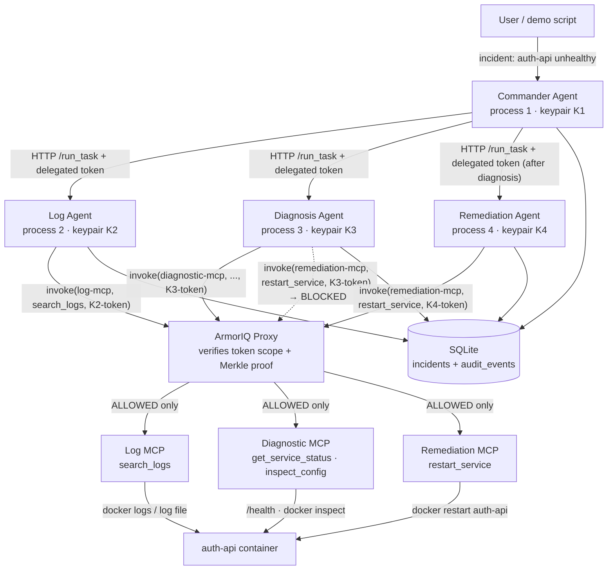
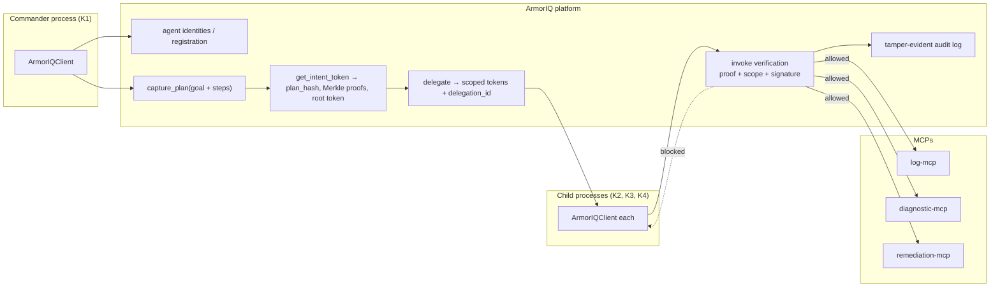
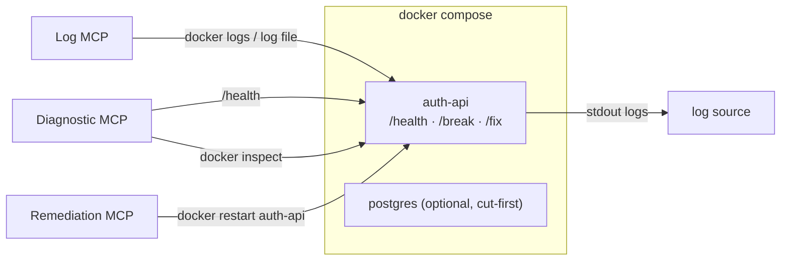
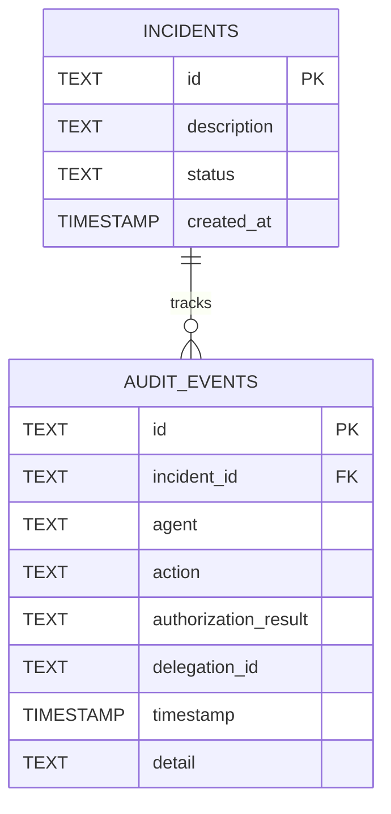

# AegisOps — ARCHITECTURE.md

**Technical blueprint.** Companion to `PLAN.md` (what we build) and `CURRENT_STATE.md` (where the project stands).
Scope: the single incident-response demo defined in PLAN.md §1. Nothing else.

---

## 1. Architecture Overview

AegisOps demonstrates that **CAPABLE ≠ AUTHORIZED**: four autonomous agent processes, each with its own
cryptographic identity, investigate and remediate a broken `auth-api` container — but only the agents whose
delegated tokens carry the authority may actually perform the restart. Authorization is enforced by the
**ArmorIQ Proxy** against signed, scoped tokens — never by string matching, and never by what the LLM "decides".

```
User / demo script
      │
      ▼
Commander Agent ──── capture_plan() → get_intent_token() → delegate() × 3
      │
      ├────► Log Agent        ──► Log MCP        ──► docker logs / log file        (read)
      ├────► Diagnosis Agent  ──► Diagnostic MCP ──► auth-api /health, docker inspect (read)
      └────► Remediation Agent──► Remediation MCP ──► docker restart auth-api        (write)

All invoke() calls pass through the ArmorIQ Proxy for verification before reaching an MCP.
```

### 1.1 The MVP (from PLAN.md §1)

| Item | Definition |
|---|---|
| **Problem** | Autonomous agents can be *capable* of an action without being *authorized* to perform it. "Who authorized that?" |
| **User** | Demo audience / judges. Triggered via `scripts/break_service.sh` and `scripts/run_incident.sh`. |
| **Core workflow** | Break service → Commander captures plan + delegates scoped tokens → Log Agent reads logs → Diagnosis Agent inspects status/config → Diagnosis Agent *attempts* restart (BLOCKED) → Commander delegates restart → Remediation Agent restarts (ALLOWED) → health verified → audit trail shown. |
| **Agents** | Commander, Log, Diagnosis, Remediation — 4 separate processes, 4 separate Ed25519 keypairs, 4 separate ArmorIQ clients. |
| **MCP tools** | `search_logs`, `get_service_status`, `inspect_config` (read-only), `restart_service` (write). |
| **Real-world action** | `docker restart auth-api` — an actual container restart, observable via `/health` and container start time. |
| **Authorization boundary** | Between the ArmorIQ Proxy and the MCPs. Every `invoke()` is checked against the signed, scoped token before the tool executes. |
| **Deliberate scope violation** | Diagnosis Agent deterministically attempts `invoke("remediation-mcp", "restart_service", diag_token)` → blocked by ArmorIQ, logged as `blocked`. |
| **Successful authorized action** | Remediation Agent calls the *same* function with the *same* parameters through the *same* tool with its own delegated token → allowed → container actually restarts. |
| **ArmorIQ responsible for** | Plan capture, intent tokens, Merkle proofs, delegation minting, `invoke()` authorization verification, tamper-evident audit trail. |
| **We are responsible for** | Agent processes, inter-agent HTTP transport, MCP tools, Docker `auth-api`, SQLite mirror (`incidents`, `audit_events`), demo/reset scripts, the (optional) trail viewer. |

### 1.2 Responsibility boundaries (never blurred)

| Layer | Owns |
|---|---|
| **Our application** | Agent processes, HTTP transport, MCP tools, Docker `auth-api`, SQLite, scripts, trail viewer. |
| **ArmorIQ** | Agent identities, plan canonicalization, tokens, Merkle proofs, delegation, `invoke()` authorization decisions, platform audit log. |
| **MCP** | The 4 tool endpoints and their mapping to real infrastructure. No authorization logic lives here. |
| **Docker/infrastructure** | The real-world effect: `auth-api` container state, `/health`, `/break`, `/fix`. |
| **LLM** | Only the Diagnosis Agent's "is a restart needed? why?" rationale. Never a control-flow decision (control flow is deterministic). |

---

## 2. System Diagram



---

## 3. Component Responsibilities

| Component | Responsibility | Not responsible for |
|---|---|---|
| **Commander Agent** | Build the explicit 4-step plan; `capture_plan()` → `get_intent_token()`; `delegate()` scoped tokens to Log, Diagnosis, and (post-diagnosis) Remediation agents; write `incidents` + `audit_events` rows; coordinate via HTTP. | Never calls MCP tools directly in-process; never runs child business logic itself. |
| **Log Agent** | Receives token+task over HTTP; `invoke("log-mcp", "search_logs", ...)`; returns log lines. | Diagnosis, status checks, restart. |
| **Diagnosis Agent** | `invoke("diagnostic-mcp", "get_service_status" | "inspect_config", ...)`; narrow LLM call for restart rationale; **deterministically attempts** the unauthorized `restart_service` call (demo centerpiece). | Restart authority. Its token never includes `restart_service`. |
| **Remediation Agent** | Receives restart authority from Commander after diagnosis; `invoke("remediation-mcp", "restart_service", ...)`; verifies recovery. | Diagnostics, logs, decision-making. |
| **Log MCP** | Exposes `search_logs(service, keyword, since)`. | Authorization (proxy's job). |
| **Diagnostic MCP** | Exposes `get_service_status(service)`, `inspect_config(service)` (redacts secrets). | Authorization. |
| **Remediation MCP** | Exposes `restart_service(service)` → real `docker restart`. | Authorization; deciding who may call it. |
| **ArmorIQ Proxy** | Authorizes every `invoke()` against the presented token; blocks non-scoped actions; records platform audit. | Business logic, tool implementation. |
| **Docker `auth-api`** | Real service with `/health`, `/break`, `/fix`; in-memory state. | Authorization. |
| **SQLite** | Thin mirror of `incidents` + `audit_events` for the demo trail. | Authorization truth — that lives in ArmorIQ. |

---

## 4. Agent Architecture

All four agents are **separate Python processes** (`agents/*.py`), started independently, each generating its
own Ed25519 keypair at startup and holding its own `ArmorIQClient` (its own ArmorIQ identity). Inter-agent
communication is HTTP: each agent exposes one `/run_task` endpoint; the Commander sends the delegated token +
task over HTTP. See PLAN.md §5.

### 4.1 Commander Agent

| Aspect | Definition |
|---|---|
| **Purpose** | Owns the incident end-to-end: captures the plan, mints the root intent token, delegates scoped authority, coordinates investigation → escalation → remediation. |
| **Input** | Incident description (hardcoded by `scripts/run_incident.sh`). |
| **Output** | Root intent token; three delegations (log, diagnosis, remediation); HTTP task dispatch; `incidents` + `audit_events` rows. |
| **Identity** | Own Ed25519 keypair `K1`; own `ArmorIQClient`. |
| **Authority** | Root intent token over the full captured plan (all 4 actions) — "everything the incident *could* require" (PLAN §6). |
| **Allowed actions** | `capture_plan()`, `get_intent_token()`, `delegate()`; any plan action at root-token level. |
| **Forbidden actions** | None at plan level — but architecturally it must not execute agent business logic in-process; in the demo it never performs `restart_service` itself. |
| **MCP tools** | None directly (orchestrates exclusively via delegation). |
| **Who delegates to it** | No one — it is the root of the delegation chain (user intent is the origin). |
| **Out-of-scope attempt** | Any action not in the captured plan would be blocked by the proxy even for the root token. |

### 4.2 Log Agent

| Aspect | Definition |
|---|---|
| **Purpose** | Fetch recent log lines for the service so the diagnosis has evidence. |
| **Input** | Delegated token (`allowed_actions=["search_logs"]`) + task over HTTP from Commander. |
| **Output** | Log lines returned to Commander / carried into the diagnosis task. |
| **Identity** | Own keypair `K2`; own `ArmorIQClient`. |
| **Authority** | `search_logs` only (1 action). |
| **Forbidden actions** | `get_service_status`, `inspect_config`, `restart_service` — not in its allow-list. |
| **MCP tools** | `log-mcp` → `search_logs`. |
| **Who delegates to it** | Commander. |
| **Out-of-scope attempt** | Blocked by proxy; logged as `blocked` (not part of the demo's core beat, but the same mechanism). |

### 4.3 Diagnosis Agent

| Aspect | Definition |
|---|---|
| **Purpose** | Gather status + config, produce an LLM-backed rationale ("does this need a restart? yes/no + one sentence"), and — **deterministically** — attempt `restart_service` with its own token to demonstrate the block. |
| **Input** | Delegated token (`allowed_actions=["get_service_status","inspect_config"]`) + task (including Log Agent's excerpts) over HTTP from Commander. |
| **Output** | Diagnosis conclusion + rationale; a guaranteed `blocked` attempt; `audit_events` row(s). |
| **Identity** | Own keypair `K3`; own `ArmorIQClient`. |
| **Authority** | `get_service_status`, `inspect_config` — read-only diagnosis (2 actions). |
| **Forbidden actions** | **`restart_service` — the hard boundary. Also `search_logs` is not delegated to it** (log evidence arrives via the task payload). |
| **MCP tools** | `diagnostic-mcp` → `get_service_status`, `inspect_config`. |
| **Who delegates to it** | Commander. |
| **Out-of-scope attempt** | `invoke("remediation-mcp","restart_service", diag_token)` → **blocked by ArmorIQ Proxy** before reaching the MCP; container is NOT restarted; row logged with `authorization_result='blocked'`. This is the demo's centerpiece — never an error to hide (PLAN §10). |

### 4.4 Remediation Agent

| Aspect | Definition |
|---|---|
| **Purpose** | Perform the restart — but only after the Commander *explicitly* grants restart authority following a "restart needed" diagnosis. |
| **Input** | Delegated token (`allowed_actions=["restart_service"]`) + task over HTTP from Commander; granted *after* diagnosis concludes, so the escalation is visible. |
| **Output** | Successful `invoke()` result; post-restart health verification; `audit_events` row. |
| **Identity** | Own keypair `K4`; own `ArmorIQClient`. |
| **Authority** | `restart_service` only (1 action). |
| **Forbidden actions** | Everything else — no diagnostics, no logs. |
| **MCP tools** | `remediation-mcp` → `restart_service`. |
| **Who delegates to it** | Commander (only after diagnosis concludes a restart is needed — the "Commander decides to escalate" beat). |
| **Out-of-scope attempt** | Any non-restart action → blocked by proxy. |

---

## 5. Agent Authority Matrix

| Action | Commander (root token) | Log Agent (K2) | Diagnosis Agent (K3) | Remediation Agent (K4) |
|---|---|---|---|---|
| `search_logs` | ✓ (in plan) | **✓ allowed** | ✗ (not delegated) | ✗ (not delegated) |
| `get_service_status` | ✓ (in plan) | ✗ | **✓ allowed** | ✗ |
| `inspect_config` | ✓ (in plan) | ✗ | **✓ allowed** | ✗ |
| `restart_service` | ✓ (in plan, never executes it in demo) | ✗ | ✗ — **attempts it, blocked** | **✓ allowed (post-diagnosis delegation)** |

Key invariants:
- **Diagnosis Agent MUST NOT have restart authority.** Its delegated `allowed_actions` excludes `restart_service` by construction.
- **Remediation Agent DOES have restart authority** — but only via the token the Commander delegates after diagnosis.
- No agent can self-escalate; `delegate()` exists only on the Commander's client.

---

## 6. Delegation Model

```
User intent ("diagnose and remediate auth-api")
        │  (origin of authority — not cryptographic)
        ▼
Commander  ── capture_plan(goal + 4 steps) ──► ArmorIQ: signed plan (plan_hash, Merkle proofs)
        │  ── get_intent_token() ──► root intent token (full 4-step authority)
        │
        ├─ delegate(token, K2, allowed=["search_logs"])                 ──► Log Agent (K2)     ──► search_logs
        ├─ delegate(token, K3, allowed=["get_service_status","inspect_config"]) ──► Diagnosis Agent (K3) ──► status/config
        └─ delegate(token, K4, allowed=["restart_service"])  [AFTER diagnosis]  ──► Remediation Agent (K4) ──► restart_service
```

### 6.1 Authority levels

| Level | Holder | What it authorizes |
|---|---|---|
| **Original user intent** | Demo script / user | The incident to handle (not cryptographic). |
| **Commander authority** | Commander + root token | The full captured 4-step plan, at root-token level. |
| **Delegated authority** | Child agents via `delegate()` | Subset of plan steps in `allowed_actions`, bound to the child's public key, time-limited. |
| **Tool-level authority** | ArmorIQ Proxy at `invoke()` | Whether this exact token may perform this exact action → forward to MCP or block. |
| **Resource-level boundaries** | MCPs + Docker | Only the 4 tool endpoints exist; no generic shell/exec tool anywhere (PLAN §9). |

### 6.2 Where the security boundary lives

The security boundary is **between the ArmorIQ Proxy and the MCPs**. The LLM (or a prompt-injected log line)
may *decide* to attempt anything; the token presented at `invoke()` determines whether the MCP ever runs.
The Diagnosis Agent's attempt and the Remediation Agent's call are byte-identical
(`restart_service("auth-api")`, same MCP, same params) — only the signed token differs (PLAN §2).

---

## 7. MCP Architecture

Three tiny MCP services (target <~80 lines each; if the full MCP protocol costs too much for one day, plain
HTTP services acting as MCP wrappers are the documented, judge-acceptable fallback — note it in README as a
scope cut, PLAN §4). No authorization logic lives in the MCPs; they trust that the proxy already verified the
caller.

### 7.1 Tool inventory

| # | MCP server | Tool | Owning agent | Purpose | Input | Output | Read/Write | Underlying resource | Authorization | Failure behavior |
|---|---|---|---|---|---|---|---|---|---|---|
| 1 | `log-mcp` | `search_logs` | Log Agent | Fetch recent log lines | `service: str`, optional `keyword`, `since` | List of log lines/dicts | Read-only | `docker logs auth-api` or mounted log file | Proxy-checked: only tokens with `search_logs` | Invalid args → 400-style error; agent logs and stops step |
| 2 | `diagnostic-mcp` | `get_service_status` | Diagnosis Agent | Health/status check | `service: str` | `{status, http_code, uptime}` | Read-only | `auth-api` `/health` endpoint | Proxy-checked: tokens with `get_service_status` | Unhealthy service → returns unhealthy status (that's data, not failure) |
| 3 | `diagnostic-mcp` | `inspect_config` | Diagnosis Agent | Read current config/env | `service: str` | Config dict, **secrets redacted** | Read-only | `docker inspect` / config file | Proxy-checked: tokens with `inspect_config` | Missing service → error result; agent logs and stops |
| 4 | `remediation-mcp` | `restart_service` | Remediation Agent | Actually restart the container | `service: str` | `{success, new_status}` | **Write** | `docker restart auth-api` | Proxy-checked: tokens with `restart_service`; **Diagnosis Agent's attempt must be rejected here** | Docker failure → retry once, then report failure (PLAN §10) |

---

## 8. ArmorIQ Architecture

ArmorIQ is the **source of truth for cryptographic authorization**. We do not implement any of this — we call
the SDK. All SDK specifics below are conceptual; exact signatures/behavior must be checked against
`docs.armoriq.ai` on implementation day.

### 8.1 Concepts

| Concept | Role in AegisOps |
|---|---|
| **Agent registration / identities** | Each of the 4 processes is its own identity with its own `ArmorIQClient`. `VERIFY AGAINST ARMORIQ SDK`: whether identity is `agent_id`-scoped or `for_user(email)`-scoped in the installed SDK version (docs show both patterns, PLAN §5). |
| **Keypairs** | Each process generates its own Ed25519 keypair at startup (`cryptography`). Public keys are handed to the Commander for `delegate()`; private keys never leave their process. |
| **`capture_plan()`** | Does **not** call an LLM. The Commander supplies the explicit `goal` + `steps` structure naming our onboarded MCPs/actions. The plan is a deliberate artifact we control. `VERIFY AGAINST ARMORIQ SDK`: whether the MCPs must be pre-registered on `platform.armoriq.ai` first. |
| **`get_intent_token()`** | Canonicalizes the plan → `plan_hash` → Merkle tree over steps → signed (Ed25519) → root intent token + per-step `step_proofs`. |
| **`delegate()`** | Mints a new, restricted, non-transferable, time-limited token bound to the delegate's public key, with an explicit `allowed_actions` allow-list and a shorter validity window than the parent; returns `delegation_id` + `trust_delta`. Children never self-escalate — only the Commander calls `delegate()`. |
| **`invoke()`** | Each call is verified at the ArmorIQ Proxy: Merkle proof, CSRG path, value digest, token signature, and scope. Allowed → forwarded to the MCP. Not in scope → `IntentMismatchException` / blocked result. `VERIFY AGAINST ARMORIQ SDK`: exact shape of the blocked response (exception vs `success: false`) so error handling matches reality. |
| **Authorization enforcement** | Keyed on the signed token/allow-list, never on action-name strings. Renaming `restart_service` → `svc_bounce_x92` in both places changes nothing (PLAN §2). |
| **Blocked actions** | Anything outside the presented token's `allowed_actions` / plan proof — e.g. Diagnosis Agent → `restart_service`. |
| **Allowed actions** | Exactly what the presented token's allow-list contains — e.g. Remediation Agent → `restart_service`. |
| **Audit trail** | ArmorIQ keeps the platform-side tamper-evident audit. We mirror every `delegate()`/`invoke()` result into our local `audit_events` table for the demo trail (PLAN §7). |

### 8.2 Lifecycle diagram



`VERIFY AGAINST ARMORIQ SDK` (all of §0 in PLAN.md): exact signatures of `capture_plan` / `get_intent_token` /
`delegate` / `invoke`, the `armoriq-sdk` PyPI package name/version, MCP pre-registration requirement, and the
blocked-response shape. Do not invent SDK APIs.

---

## 9. Infrastructure Architecture

Minimal Docker environment (PLAN §3, §13 Phase 2).

### 9.1 Services

| Service | Why it exists | State |
|---|---|---|
| `auth-api` (FastAPI/Flask) | The service we break and heal — the real-world effect of `restart_service` | In-memory: a healthy flag. `/health` → 200 when healthy, 5xx when broken. Optional Postgres only for "looks real" flavor; **cut first** if short on time. |
| Postgres (optional) | Cosmetic only | Cut-first per PLAN §3/§13. |

### 9.2 Lifecycle

| Phase | Mechanism |
|---|---|
| **Start** | `scripts/start_env.sh` → `docker compose up -d`, wait for `/health` 200. |
| **Break** | `scripts/break_service.sh` → `POST /break` flips `auth-api` into a 500-erroring "unhealthy" state **without stopping the container** (so `get_service_status()` can still observe it). |
| **Detect** | `get_service_status()` hits `auth-api` `/health`. |
| **Restart** | `restart_service()` runs `docker restart auth-api` (or `docker compose restart auth-api`). Restart clears the in-memory broken flag → container comes back healthy. |
| **Verify** | Poll `/health` until 200 OK, 30s timeout. |
| **Reset** | `scripts/reset_demo.sh` → `POST /fix` (inverse of `/break`) + clear SQLite `incidents`/`audit_events`; or full `docker compose down -v && up -d`. |

### 9.3 Infrastructure diagram



---

## 10. Data Architecture

Only the minimum persistent data (PLAN §7). SQLite, raw `sqlite3`, no ORM.

### 10.1 Entities

**`incidents`**

| Field | Type | Notes |
|---|---|---|
| `id` | TEXT (PK) | Incident identifier |
| `description` | TEXT | Incident description (e.g. "auth-api unhealthy") |
| `status` | TEXT | `open` / `investigating` / `resolved` |
| `created_at` | TIMESTAMP | |

**`audit_events`**

| Field | Type | Notes |
|---|---|---|
| `id` | TEXT (PK) | |
| `incident_id` | TEXT (FK → incidents) | Ties blocked + allowed rows to the same incident |
| `agent` | TEXT | `commander` / `log` / `diagnosis` / `remediation` |
| `action` | TEXT | e.g. `restart_service` |
| `authorization_result` | TEXT | `allowed` / `blocked` / `error` |
| `delegation_id` | TEXT, nullable | From ArmorIQ `delegate()` result |
| `timestamp` | TIMESTAMP | |
| `detail` | TEXT | Free text: params, error messages, rationale |

### 10.2 Storage split

| Stored where | What |
|---|---|
| **Locally (SQLite)** | `incidents`; `audit_events` — a **thin mirror** of ArmorIQ results so the demo trail renders without querying the platform live. |
| **ArmorIQ platform** | Signed tokens, plan hashes, Merkle proofs, delegation records (`delegation_id`, `trust_delta`), tamper-evident audit log — the authoritative crypto records. |
| **Not stored** | Log payloads, config contents, LLM prompts; optional: diagnosis rationale in `audit_events.detail`. |



---

## 11. Security Model

No implementation — the design (PLAN §9, §2):

- **Least privilege** — each delegated token's `allowed_actions` contains only what the role needs: Log = 1, Diagnosis = 2, Remediation = 1.
- **Agent isolation** — 4 separate processes; no shared in-process state; the Commander never calls child business logic in-process.
- **Separate identities** — each process has its own Ed25519 keypair; delegated tokens are cryptographically bound to the delegate's public key, so a token from one process can't be presented by another (PLAN §9).
- **Delegation** — only the Commander calls `delegate()`; children cannot self-escalate; tokens are non-transferable and time-limited.
- **Scope enforcement** — the ArmorIQ Proxy checks the token's allow-list + Merkle proof at every `invoke()`. Enforcement is keyed on the signed artifact, not on action-name strings.
- **Prompt injection from logs** — a malicious log line seeds the log source (PLAN §9): even if it manipulates the Diagnosis Agent's LLM into "deciding" to restart, the deterministic follow-up attempt is blocked — capability ≠ authority.
- **Unauthorized tool calls** — demonstrated by the Diagnosis Agent's `restart_service` attempt and blocked by design; logged as `blocked` (a success case for the demo, never an error to hide).
- **Auditability** — every `delegate()`/`invoke()` produces records mirrored into `audit_events`; walk the trail live in the demo.
- **Secrets** — `ARMORIQ_API_KEY` only in `.env` (gitignored); never logged or printed.

**Central rule:** the LLM may decide to attempt something; **ArmorIQ decides whether the agent is AUTHORIZED** to perform it. The Diagnosis Agent restart attempt is the canonical example.

---

## 12. Failure Boundaries

From PLAN §10 — intended behavior only, no complicated recovery:

| Failure | Intended behavior |
|---|---|
| **LLM fails** (diagnosis rationale) | Narrow prompt; on failure, Diagnosis Agent reports "inconclusive" → Commander does not escalate → incident left `investigating` (safe, demoable state). `DECISION NEEDED`: confirm this fallback at implementation start. |
| **MCP unavailable** | Agent catches connection error, logs `audit_events` row (`authorization_result='error'`), retries once, then surfaces a clear message; doesn't crash the demo. |
| **ArmorIQ rejects an action** | Expected for the Diagnosis Agent's restart attempt → caught explicitly, logged as `blocked`. **This is the demo's success case.** |
| **Invalid tool arguments** | MCP validates required fields (`service` present) → 400-style error → agent logs and stops that step. |
| **Docker service fails** | `restart_service()` retries once, then reports failure; demo script has manual `docker restart auth-api` fallback. |
| **Agent crashes** | Independent processes — only that agent stops; Commander logs "no response"; demo script restarts the process. |
| **Duplicate execution** | Idempotency: before `restart_service`, Remediation Agent checks health; if already healthy, logs a no-op instead of restarting twice. |

---

## 13. Repository Structure

Per PLAN.md §12, plus the three project documents at root:

```
AegisOps/
├── agents/
│   ├── commander.py          # Process 1: plan capture, tokens, delegation, orchestration
│   ├── log_agent.py          # Process 2: search_logs via log-mcp
│   ├── diagnosis_agent.py    # Process 3: status/config + LLM rationale + deterministic blocked attempt
│   └── remediation_agent.py  # Process 4: authorized restart_service
├── mcp/
│   ├── log_mcp.py            # search_logs tool
│   ├── diagnostic_mcp.py     # get_service_status + inspect_config tools
│   └── remediation_mcp.py    # restart_service tool
├── armoriq/
│   └── client_setup.py       # Shared helper: ARMORIQ_API_KEY loading, keypair helpers
├── infrastructure/
│   ├── auth_api/
│   │   └── main.py           # Tiny FastAPI app: /health, /break, /fix
│   └── docker-compose.yml    # (root docker-compose.yml may supersede; keep single source)
├── database/
│   ├── schema.sql            # incidents + audit_events DDL
│   └── db.py                 # Thin sqlite3 wrapper
├── tests/
│   ├── test_mcp_tools.py     # Direct MCP tool tests vs running container
│   ├── test_authorization.py # Security path (blocked) + happy path (allowed) — critical
│   └── test_e2e.py           # Full incident flow + final health assertion
├── scripts/
│   ├── start_env.sh          # compose up + wait for health
│   ├── break_service.sh      # POST /break
│   ├── run_incident.sh       # Kick off Commander with hardcoded incident
│   └── reset_demo.sh         # POST /fix + clear SQLite rows
├── .env.example              # ARMORIQ_API_KEY placeholder — never the real .env
├── .gitignore
├── docker-compose.yml        # auth-api (+ optional postgres)
├── requirements.txt
├── README.md                 # Public-facing introduction
├── PLAN.md                   # Source of truth: what we build
├── ARCHITECTURE.md           # This file: how it will be structured
└── CURRENT_STATE.md          # Living status: where the project stands
```

Placeholder-only files currently exist for every directory (`.gitkeep`); no implementation code exists.

---

## 14. Important Architectural Decisions

| # | Decision | Rationale | Source |
|---|---|---|---|
| 1 | 4 separate processes, each with own keypair + own `ArmorIQClient` | Satisfies "separate clients with separate keypairs" minimally without a distributed system | PLAN §5 |
| 2 | Inter-agent transport = simple HTTP (`/run_task` endpoint per agent) | Fastest to build/debug; realistic | PLAN §5 |
| 3 | `capture_plan()` receives an explicit plan artifact we construct | SDK does not invent plans; makes the plan a deliberate, auditable artifact | PLAN §0 |
| 4 | Unauthorized-attempt control flow is deterministic (hardcoded), LLM only produces rationale text | 100% reproducible demo | PLAN §8 |
| 5 | Local SQLite is a thin mirror; ArmorIQ is the source of truth | Demo trail works offline/flaky-network | PLAN §7 |
| 6 | MCPs are plain HTTP services wrapping tools (real MCP protocol optional) | One-day scope; documented as a judge-acceptable cut | PLAN §4, §20 |
| 7 | Commander dispatch may be hardcoded (safe cut); only Diagnosis LLM call is "must-have-ish" (SHOULD HAVE) | Timebox | PLAN §8, §14 |
| 8 | Secrets in `.env` only; no Vault/KMS | Explicit DO-NOT-BUILD | PLAN §14 |
| 9 | No generic agent framework; build exactly this scenario | Explicit DO-NOT-BUILD | PLAN §14 |
| 10 | Trail viewer = minimal HTML page OR plain terminal/`audit_events` output | Option 2 only if Phase 10 time remains; Option 1 is judge-acceptable | PLAN §15 |

---

## 15. Open Questions / Verification Items

### VERIFY AGAINST ARMORIQ SDK (docs.armoriq.ai, on implementation day)
- [ ] Exact package name/version (`armoriq-sdk` on PyPI) and install requirements.
- [ ] Client initialization: `agent_id`-scoped vs `for_user(email)`-scoped in the installed version.
- [ ] Must MCPs be pre-registered on `platform.armoriq.ai` before `capture_plan()`/`invoke()` accept them?
- [ ] Current signatures of `capture_plan(llm, prompt, plan, metadata?)`, `get_intent_token(plan_capture)`, `delegate(intent_token, delegate_public_key, validity_seconds, allowed_actions, subtask?)`, `invoke(mcp, action, intent_token, params?, merkle_proof?, user_email?)`.
- [ ] Shape of the "blocked" response from `invoke()` (exception vs `success: false`) for error handling.
- [ ] Whether `get_intent_token()` returns the root token directly and whether `step_proofs` need explicit passing at `invoke()`.

### DECISION NEEDED
- [ ] Include the optional Postgres container for "real infra" flavor, or cut? (Default: cut unless time is ahead of schedule.)
- [ ] Trail viewer: minimal HTML page vs terminal/`audit_events` output only? (Default: terminal; HTML only if Phase 10 has time.)
- [ ] Include the malicious-log prompt-injection beat in the first demo run? (Default: yes — PLAN SHOULD HAVE.)
- [ ] LLM failure fallback for Diagnosis Agent: report inconclusive and stop (no escalation)? (Default: yes.)

---

## 16. Future Implementation Sequence

Dependency-aware order from PLAN §13. Each phase is gated on the previous one:

| # | Phase | Why this order |
|---|---|---|
| 1 | **Project skeleton** — `.gitignore`, `.env.example`, deps, compose skeleton, API key working | Foundation; everything else depends on it |
| 2 | **Docker infrastructure** — `auth-api` with `/health` `/break` `/fix`; manual break/restart/heal | MCPs need a real target; proves the real-world effect first |
| 3 | **MCP tools** — `log_mcp.py`, `diagnostic_mcp.py`, `remediation_mcp.py` (direct HTTP, curl-testable) | Agents need tools; tools need infra (Phase 2) |
| 4 | **Agent processes, unguarded** — 4 processes + HTTP transport + LLM diagnosis, calling MCPs directly (no ArmorIQ) | Safety net (PLAN §20 fallback); validates the scenario end-to-end before adding crypto |
| 5 | **ArmorIQ identities + plan** — per-agent keypairs; `capture_plan()` → `get_intent_token()` | The authorization layer's foundation |
| 6 | **ArmorIQ delegation** — `delegate()` ×3 with correct `allowed_actions` | Tokens are the currency of Phase 7 |
| 7 | **Wire `invoke()` into every MCP call** — replace direct HTTP calls | The scenario now runs through ArmorIQ |
| 8 | **The violation + enforcement** — Diagnosis Agent's blocked `restart_service`; audit row | The demo's centerpiece; depends on 5-7 |
| 9 | **Authorized remediation** — post-diagnosis delegation → allowed restart → health recovery | Completes the block/allow story |
| 10 | **Testing + audit trail + demo polish** — the 2 critical tests, trail viewer or terminal output, reset script, rehearsal | Only meaningful once 2-9 work; end with repeatability |

Unguarded flow (Phase 4) is intentionally kept working as a fallback in case ArmorIQ SDK behavior differs
from docs on demo day (PLAN §20).

---

## 17. Document Map

- `PLAN.md` — WHAT: scope, scenario, SDK reality check, one-day plan, priority tiers.
- `ARCHITECTURE.md` (this file) — HOW: structure, responsibilities, authority, data, security, order.
- `CURRENT_STATE.md` — WHERE: current status, decisions, unknowns, next steps.
- `README.md` — WHAT the project is for a newcomer (public-facing, concise).